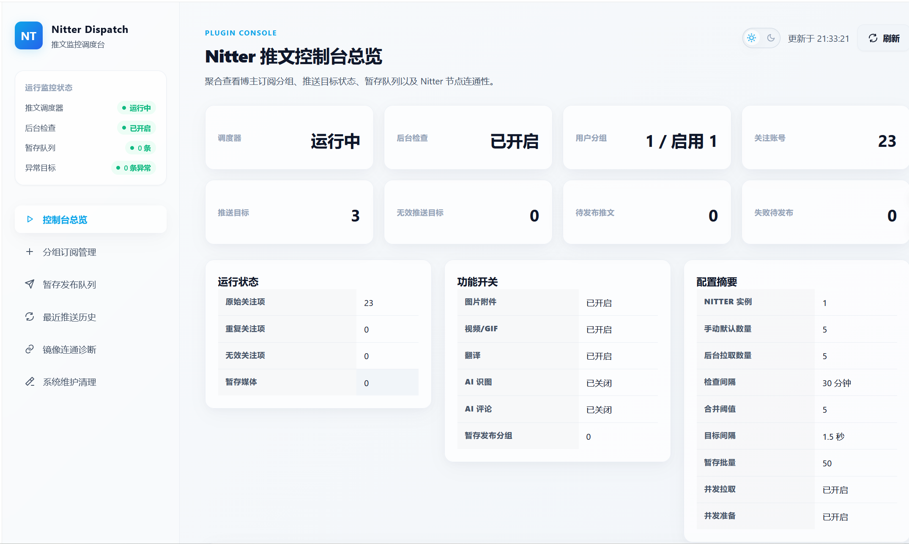
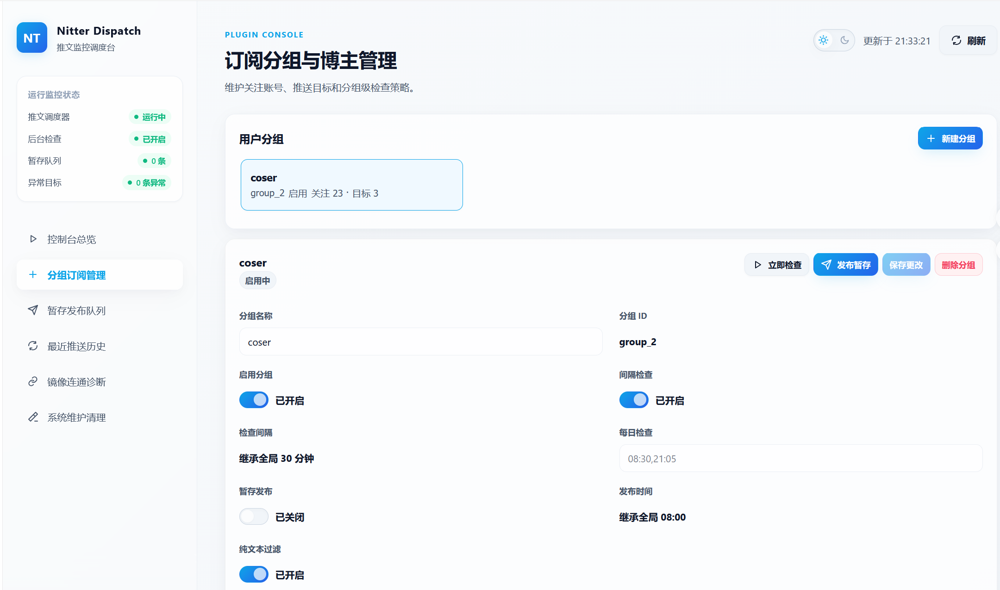
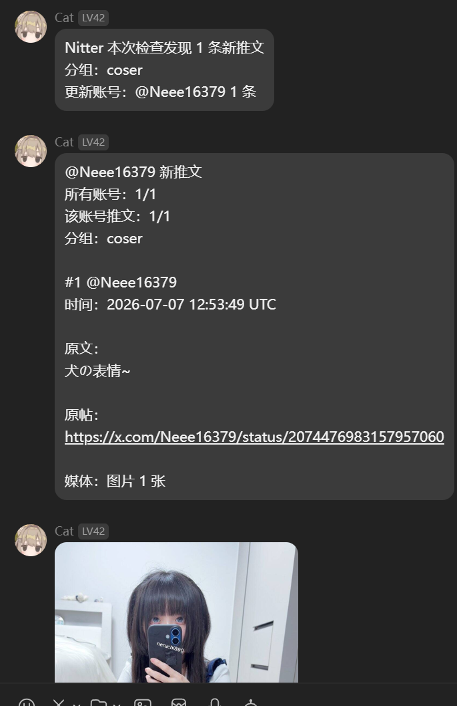

# Nitter 推文记录

<p align="center">
  
  
  
  
  
  <br />
  
  <br />
  
</p>

通过 Nitter RSS 获取指定 X/Twitter 用户公开推文，支持手动查询、镜像测试、图片附件、翻译、AI 评论、AI 识图、定时推送、暂存发布和 SQLite 推送记录/暂存队列存储。

## 界面预览

### WebUI 运维面板

<p align="center">
  
</p>

<p align="center">
  
</p>

### QQ 推送效果

<p align="center">
  
</p>

## 功能概览

| 场景 | 能力 |
| --- | --- |
| 手动查询 | `/推文` 查询公开推文，`/镜像测试` 临时验证 Nitter 实例。 |
| 后台推送 | 按 `tweet_groups` 分组订阅、定时检查、即时推送或暂存发布。 |
| 平台发送 | QQ/OneBot 支持合并转发；Lark、Telegram、微信 OC 和其他平台走普通发送。 |
| 媒体与 AI | 支持图片附件；可选开启视频/GIF、翻译、AI 识图和 AI 评论。 |
| 运维存储 | 提供 WebUI 面板、缓存清理、推送记录清理和 SQLite 暂存队列。 |

## 快速开始

### 手动查询

```text
/推文 nasa
/推文 nasa 5
/推文 https://twitter.com/nasa 5
```

省略数量时使用 `default_limit`；填写数量时按用户输入获取，不额外截断。开启转发过滤、Nitter RSS 返回不足或部分内容解析失败时，最终发送数量可能少于请求数量。

### 镜像测试

```text
/镜像测试 https://nitter.net
/镜像测试 3 https://nitter.net
/镜像测试 nasa https://nitter.net
/镜像测试 nasa 3 https://nitter.net
```

`/镜像测试` 默认测试 `nasa`，默认获取 `default_limit` 条。镜像站必须填写完整 `http://` 或 `https://` 地址，只影响本次测试，不会写入 `instances` 配置。

### 后台推送

最小配置：

```text
schedule_enabled = true
tweet_groups:
  - name: 默认分组
    group_id: default
    watch_users: NASA, BBCWorld
    push_targets: aiocqhttp:GroupMessage:123456
```

每个用户分组都有自己的 `watch_users` 和 `push_targets`。手动 `/推文检查` 会按当前会话 UMO 匹配已启用分组；当前会话必须写在该分组 `push_targets` 中才会执行。

### 本地诊断脚本

```text
python scripts\probe_nitter_fetch.py nasa 5
python scripts\probe_nitter_fetch.py nasa 5 --include-reposts
```

该脚本复用插件的 Nitter RSS 抓取和转发过滤逻辑。`--include-reposts` 会临时关闭转发过滤，便于对比 Nitter RSS 原始返回。

## 推送目标

在要接收推送的群聊或私聊里发送 `/sid`，复制返回的 UMO，填入 `push_targets`。

```text
aiocqhttp:GroupMessage:123456
aiocqhttp:FriendMessage:123456
lark:GroupMessage:oc_xxxxxxxxxxxxx
lark:FriendMessage:ou_xxxxxxxxxxxxx
telegram:GroupMessage:-1001234567890
telegram:FriendMessage:123456789
```

`push_targets` 每行填写一个 UMO。不同平台的前缀以 `/sid` 实际返回为准，不需要手动猜平台 ID；自定义 QQ 平台 ID 也应直接使用 `/sid` 返回的完整 UMO。

## WebUI 运维面板

AstrBot 插件页面中会显示 `Nitter 推文面板`，用于日常查看和维护：

- `概览`：查看调度器、后台检查、关注账号、推送目标、暂存队列、功能开关和关键配置摘要。
- `分组订阅`：维护分组名称、启停、每日检查、暂存开关、纯文本过滤、关注账号和推送目标。
- `暂存队列`：查看待发布推文、失败次数、已送达目标和媒体数量，并支持按分组发布。
- `最近推送`：查看成功送达历史，按分组和博主筛选，并使用当前推送目标重新推送。
- `镜像测试` / `缓存清理`：临时测试 Nitter 镜像连通性，或清理普通媒体缓存和推送记录。

WebUI 不替代 AstrBot 设置页；Nitter 实例、媒体限制、AI provider、提示词、并发与限流等复杂配置仍在 `_conf_schema.json` 对应的 AstrBot 配置界面维护。完整页面行为见 [进阶说明](./docs/advanced.md#webui-运维面板)。

## 常用命令

| 命令 | 说明 |
| --- | --- |
| `/推文 用户名 [数量]` | 查询指定公开 X/Twitter 用户最近推文。 |
| `/镜像测试 [用户名] [数量] 镜像站URL` | 用临时 Nitter 镜像站测试获取推文。 |
| `/推文状态` | 查看调度器状态、分组、目标、无效项和推送记录索引数。 |
| `/推文检查 [分组名]` | 立即执行一次当前会话有权限的分组检查。 |
| `/推文缓存清理` | 清理普通图片/视频缓存，不删除暂存队列媒体。 |
| `/推文记录清理 确认` | 清理全部分组推送记录；也支持指定分组。 |
| `/推文队列 [分组名]` | 查看暂存队列数量、失败重试数量和发布时间。 |
| `/推文发布 [分组名]` | 立即发布暂存队列中的推文。 |
| `/订阅列表` | 查看默认分组有效账号、重复项和无效项。 |
| `/订阅导入 账号1,账号2 [分组名]` | 批量追加订阅账号。 |
| `/订阅删除 账号1,账号2 [分组名]` | 批量删除订阅账号。 |
| `/订阅导出` | 按分组导出订阅账号。 |
| `/订阅去重` | 规范化并去重默认分组关注账号。 |

## 常用配置

这里只列日常最常调整的项；完整默认值和 WebUI 文案见 [_conf_schema.json](./_conf_schema.json)。

| 配置 | 说明 |
| --- | --- |
| `instances` | Nitter 实例列表，按顺序尝试，建议把自建实例放在第一位。 |
| `request_timeout` | 单次 RSS 请求等待某个 Nitter 实例响应的最长秒数。 |
| `default_limit` | 手动 `/推文` 和 `/镜像测试` 未填写数量时的默认获取条数。 |
| `filter_reposts_enabled` | 是否过滤博主转发他人的推文，默认开启。 |
| `schedule_enabled` | 后台检查总开关；关闭后不会触发分组间隔检查和每日检查。 |
| `tweet_groups` | 用户分组列表，配置关注账号、推送目标、间隔检查、每日检查和暂存开关。 |
| `scheduled_fetch_limit` | 后台检查时每个账号拉取最近多少条用于对比。 |
| `notify_no_updates` | 无新推文或首次记录账号时是否发送检查摘要。 |
| `merge_tweet_threshold` | QQ/OneBot 新推文总数达到多少条时启用合并转发；`0` 关闭。 |
| `deferred_publish_times` | 暂存队列发布时间列表，格式 `HH:MM`。 |
| `send_image_attachments` | 是否发送图片附件，默认开启。 |
| `send_video_attachments` | 是否发送视频/GIF 附件，默认关闭。 |
| `translate_enabled` | 是否翻译非中文推文。 |
| `comment_enabled` | 是否按概率追加 AI 评论。 |
| `vision_enabled` | 是否启用 AI 识图；结果主要作为 AI 评论上下文。 |

## 行为要点

- 首次启用某个账号时，只记录当前 RSS 中已有推文 ID，不推送历史内容。
- `filter_reposts_enabled` 开启时，会比较 RSS item 主链接作者和订阅账号；作者不同则视为转发并过滤，无法解析作者时保留。
- 推送记录按 `group_id + username` 独立存储；同一账号在不同分组里的记录互不影响。
- 手动 `/推文 用户名 数量` 不写入推送记录；后台检查和暂存发布会写入推送记录。
- QQ 合并转发只对 OneBot/`aiocqhttp` 类目标生效；Telegram、飞书/Lark、微信 OC 和其他平台始终普通发送。
- 附件失败不会阻止推文文本和原文链接发送；普通媒体发送后会自动清理，暂存媒体会保留到发布流程处理。
- `scheduled_fetch_limit` 是每个账号本轮最多保留的有效推文数；Nitter RSS 会按 `Min-Id` 游标翻页，不是固定只拉一页。

## 更多说明

- [进阶说明](./docs/advanced.md)：平台差异、流程图、完整配置参考、缓存/推送记录/暂存发布细节。
- [_conf_schema.json](./_conf_schema.json)：插件配置默认值和 AstrBot WebUI 文案。
- [CHANGELOG.md](./CHANGELOG.md)：版本变更记录。

## 致谢

- [`astrbot_plugin_parser`](https://github.com/Zhalslar/astrbot_plugin_parser)：参考了 Twitter/X 媒体解析、媒体下载与消息发送分层思路。
- [Nitter](https://github.com/zedeus/nitter)：提供公开推文 RSS 访问方式。
- [xdown.app](https://xdown.app/)：提供 Twitter/X 媒体解析接口。
- [AstrBot](https://github.com/Soulter/AstrBot)、OneBot/aiocqhttp 生态：提供插件运行、消息组件与合并转发能力。
- [PeeGayhub Telegram 表情包系列](https://t.me/addstickers/PeeGayhub)：插件图标借鉴了该系列表情包风格；图标素材由 GPT 生成。

## 许可证

本项目代码采用 MIT License，详见 [LICENSE](./LICENSE)。

## 免责声明

本插件仅用于访问和转发公开可见的 X/Twitter 推文 RSS 内容，不提供绕过平台访问控制、批量抓取非公开内容或规避第三方服务限制的能力。使用本插件时，请自行确认并遵守 X/Twitter、Nitter 实例、xdown.app 以及消息平台的服务条款、速率限制和内容使用规则。
