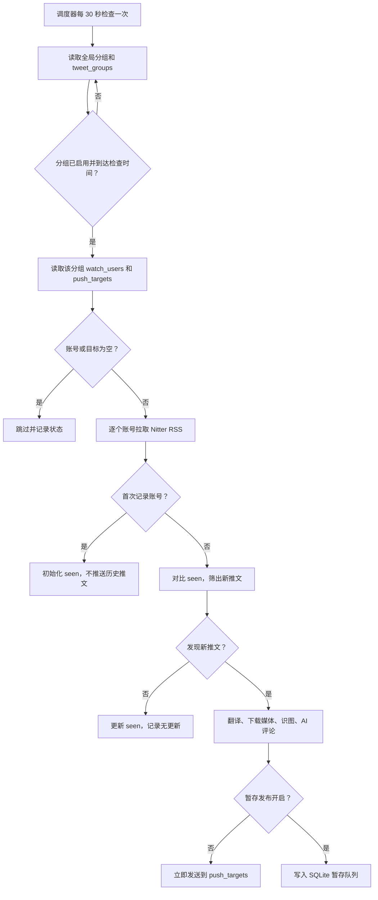
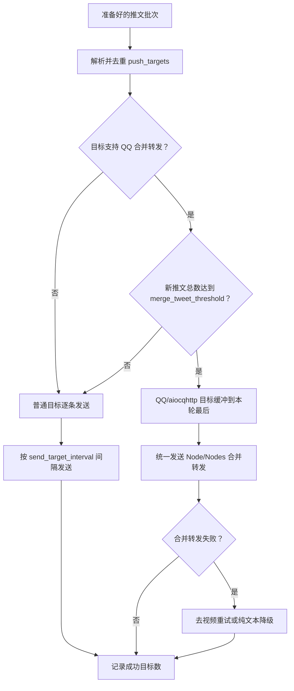
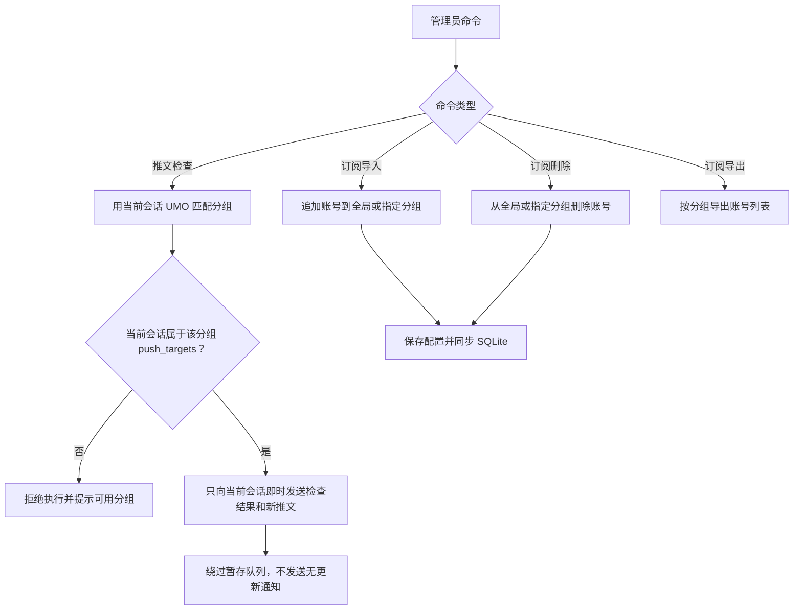

# Nitter 推文记录

<p align="center">
  
  
  
  
  
  <br />
  
</p>

通过 Nitter RSS 获取指定 X/Twitter 用户公开推文，支持手动查询、当前会话手动检查、图片附件、翻译、AI 评论、AI 识图、即时推送、暂存发布和定时推送。

## 功能

- 手动查询指定用户最近公开推文，并提供独立的 Nitter 镜像站测试命令。
- 定时检查 `watch_users`，发现新推文后推送到 `push_targets`；也可在插件配置里通过 `tweet_groups` 配置多个独立推文分组，推文正文会显示来源分组。
- 普通目标按单条推文即时处理和发送；QQ/`aiocqhttp` 合并转发目标仍按阈值缓冲到本轮最后统一发送。
- 支持图片附件发送；视频/GIF 可选发送，默认仅保留原帖链接。
- 支持非中文推文翻译。
- 支持按概率追加 AI 评论；AI 识图结果会作为评论上下文使用，不单独显示在推文消息里。AI 评论仅在翻译或识图实际产生结果后触发。
- 支持 SQLite seen/queue 存储、暂存定时发布、暂存队列查看和手动发布。
- 支持多个 Nitter 实例按顺序重试。
- 支持为 QQ/`aiocqhttp` 按新推文数量阈值启用 OneBot v11 `Node/Nodes` 合并转发；飞书/Lark、Telegram 和微信 OC 始终走普通逐账号发送，其中飞书会优先把单个账号的正文和图片放入同一条原生 `post` 消息。

## 快速开始

### 手动查询

```text
/推文 nasa
/推文 nasa 5
/推文 https://twitter.com/nasa 5
```

省略数量时使用 `default_limit`，填写数量时按用户输入获取，不额外截断；为避免刷屏和公共 Nitter 实例压力，日常不要一次请求过多。

### 镜像测试

```text
/镜像测试 https://nitter.net
/镜像测试 3 https://nitter.net
/镜像测试 nasa https://nitter.net
/镜像测试 nasa 3 https://nitter.net
```

`/镜像测试` 默认测试 `nasa`，默认获取 `default_limit` 条；用户名和数量都可以省略。镜像站必须填写完整 `http://` 或 `https://` 地址，只影响本次测试，不会写入 `instances` 配置。

### 定时推送

最小配置：

```text
schedule_enabled = true
watch_users = NASA, BBCWorld
push_targets = aiocqhttp:GroupMessage:123456
```

`push_targets` 是新推文本体的发送目标。手动执行 `/推文检查` 时会按当前会话 UMO 匹配分组：全局分组要求当前会话写在顶层 `push_targets` 中，自定义分组要求当前会话写在该分组 `push_targets` 中且分组已启用。手动检查的新推文本体只临时发送回当前会话；即使该分组开启了暂存发布，也不会把本次新推文写入暂存队列。

自定义分组可在插件配置的 `tweet_groups` 中添加。每个分组都有独立的关注账号、推送目标、间隔检查、每日定点、拉取条数和发送间隔；不填写 `tweet_groups` 时只使用上面的全局定时配置。

## 推送目标格式

在要接收推送的群聊或私聊里发送 `/sid`，复制返回的 UMO，填入 `push_targets`。

```text
aiocqhttp:GroupMessage:123456
aiocqhttp:FriendMessage:123456
lark:GroupMessage:oc_xxxxxxxxxxxxx
lark:FriendMessage:ou_xxxxxxxxxxxxx
telegram:GroupMessage:-1001234567890
telegram:FriendMessage:123456789
```

`push_targets` 每行填写一个 UMO。不同平台的前缀以 `/sid` 实际返回为准，不需要手动猜平台 ID。

## 平台支持与要求

| 平台 | 适配器类型 | 特殊要求/说明 |
| --- | --- | --- |
| QQ | `aiocqhttp` | 支持文本、图片和 OneBot v11 `Node/Nodes` 合并转发；合并转发失败时会降级重试。 |
| Feishu / Lark | `lark` | 普通逐账号发送；优先使用飞书原生 `post` 将正文和本地图片放在同一条消息中，失败时降级为 `text` 正文加普通媒体附件；暂不支持 QQ 式合并转发。 |
| Telegram | `telegram` | 走 AstrBot 通用消息链发送；在群聊中使用前建议确认 BotFather 隐私模式和群内权限。 |
| 微信 OC | `weixin_oc` | 走 AstrBot 通用消息链发送；媒体附件是否可用取决于微信 OC 适配器的上传能力、会话 token 和平台限制。 |

## 工作流程

### 定时检查与推送



### 多目标发送



### 手动检查与订阅维护



## 命令

0.9.0 起只保留主命令，不再注册命令别名。

### 普通命令

| 命令 | 说明 |
| --- | --- |
| `/推文 用户名 [数量]` | 查询指定公开 X/Twitter 用户最近推文。 |
| `/镜像测试 [用户名] [数量] 镜像站URL` | 用临时 Nitter 镜像站测试获取推文；镜像站必须是完整 `http://` 或 `https://` 地址；默认用户名 `nasa`，默认数量使用 `default_limit`。 |

### 管理员命令：调度与队列

| 命令 | 说明 |
| --- | --- |
| `/推文状态` | 查看调度器状态、全部分组项合计、默认分组和自定义分组的关注账号、推送目标、无效项和已记录账号索引数；长列表最多显示 10 项。 |
| `/推文检查 [分组名]` | 立即执行一次定时检查；不填时按当前会话 UMO 匹配全局或唯一已启用自定义分组，填写时可指定分组名称、分组 ID 或别名；手动检查只向当前会话发送新推文和结果摘要，并在结果末尾显示该分组当前暂存状态。 |
| `/推文缓存清理` | 清理普通图片/视频缓存文件；会清理当前插件数据目录缓存和旧版源码目录缓存的根目录文件，保留暂存队列媒体目录。 |
| `/推文记录清理 确认` | 清理全部分组的已记录推文索引，并删除旧版 KV seen 数据；不会删除订阅配置、暂存队列或媒体文件。也可用 `/推文记录清理 分组名 确认` 只清指定分组的 SQLite seen。 |
| `/推文队列 [分组名]` | 查看暂存发布队列数量、失败重试数量、暂存账号、暂存媒体数量和发布时间；不填时查看全局分组。 |
| `/推文发布 [分组名]` | 立即发布暂存队列中的推文；不填时发布全局分组。 |

### 管理员命令：订阅管理

| 命令 | 说明 |
| --- | --- |
| `/订阅列表` | 查看当前 `watch_users` 的有效账号、重复项和无效项。 |
| `/订阅导入 账号1,账号2 [分组名]` | 批量追加订阅账号；账号之间只用英文逗号分隔。不填分组时写入全局 `watch_users`，最后一个空格后的参数匹配到分组名称、分组 ID 或别名时写入对应 `tweet_groups[*].watch_users`。只接受 `用户名` 或 `@用户名`，单次最多 50 个。 |
| `/订阅删除 账号1,账号2 [分组名]` | 批量删除订阅账号；账号之间只用英文逗号分隔。不填分组时从全局 `watch_users` 删除，最后一个空格后的参数匹配到分组名称、分组 ID 或别名时从对应 `tweet_groups[*].watch_users` 删除。只接受 `用户名` 或 `@用户名`，单次最多 50 个。 |
| `/订阅导出` | 按分组导出订阅账号，每行格式为 `分组名称: 账号1,账号2`。 |
| `/订阅去重` | 规范化并去重 `watch_users`，移除重复账号和无效条目后保存配置。 |

## 配置参考

完整默认值见 [_conf_schema.json](./_conf_schema.json)。AstrBot 设置界面已按“基础、媒体、AI 翻译、AI 评论、AI 识图、定时检查、暂存发布、推送目标与分组、并发与限流”分组展示；旧版本的扁平配置仍会兼容读取。`并发与限流` 目前是预留栏目，多推文抓取、翻译、评论和发送仍按当前串行流程与发送间隔执行；单条推文内多张图片识图会并发调用模型。

### 基础

| 配置 | 说明 |
| --- | --- |
| `instances` | Nitter 实例列表，建议把自建实例放在第一位。 |
| `storage_backend` | 存储后端；运行期固定使用本地 SQLite 数据库。旧 KV seen 数据只会在启动迁移时自动导入，不再作为运行后端。 |
| `request_timeout` | 单个 Nitter 实例超时秒数，超时后尝试下一个实例。 |
| `default_limit` | 手动 `/推文` 和 `/镜像测试` 未填写数量时的默认获取条数；填写数量时不额外截断。 |
| `cooldown_seconds` | 同一会话同一用户的命令冷却时间。 |
| `user_agent` | 请求 Nitter RSS 时使用的 User-Agent。 |

### 定时推送

| 配置 | 说明 |
| --- | --- |
| `schedule_enabled` | 是否启用后台定时检查；手动 `/推文检查` 是否允许执行主要看当前会话是否在对应分组的 `push_targets` 中。 |
| `watch_users` | 关注账号列表，支持 `NASA`、`@NASA`、`https://x.com/NASA`。 |
| `push_targets` | 新推文本体发送目标；在目标会话发送 `/sid` 获取 UMO 后填入。 |
| `tweet_groups` | 自定义推文分组列表；每组可单独配置 `watch_users`、`push_targets`、间隔检查、每日定点、拉取条数和发送间隔。 |
| `interval_check_enabled` | 是否启用间隔检查。 |
| `check_interval_minutes` | 每 N 分钟检查一次。 |
| `daily_check_enabled` | 是否启用每日固定时间检查。 |
| `daily_check_times` | 每日检查时间列表，格式 `HH:MM`。 |
| `scheduled_fetch_limit` | 定时检查时每个账号拉取最近多少条用于对比。 |
| `notify_no_updates` | 无新推文或首次记录账号时是否发送检查摘要。 |
| `check_on_startup` | 插件启动后是否立即检查一次。 |
| `merge_tweet_threshold` | QQ/`aiocqhttp` 新推文总数达到多少条时启用合并转发；`0` 关闭，默认 `2`。 |
| `send_target_interval` | 多个目标之间的发送间隔。 |
| `send_user_interval` | 多个账号之间的发送间隔。 |

### 暂存定时发布

| 配置 | 说明 |
| --- | --- |
| `deferred_publish_enabled` | 是否启用暂存发布；开启后后台定时检查发现的新推文先写入 SQLite，不立即发送。 |
| `deferred_publish_times` | 暂存队列发布时间列表，格式 `HH:MM`。 |
| `deferred_publish_batch_limit` | 每次最多发布多少条暂存推文，默认 `50`。 |
| `deferred_prefetch_media` | 是否在暂存入队时预下载图片/视频到 `cache/staged/`。 |
| `deferred_media_retention_hours` | 暂存媒体保留小时数，用于清理长期未发布或失败重试遗留的媒体文件。 |
| `deferred_media_download_interval_seconds` | 暂存媒体预下载时每条推文之间的额外等待秒数，降低连续下载压力。 |

全局配置和 `tweet_groups` 分组配置都支持这些字段。暂存发布开启后，后台检查时间仍由 `interval_check_enabled`、`check_interval_minutes`、`daily_check_enabled`、`daily_check_times` 控制；发布时间由 `deferred_publish_times` 控制。手动 `/推文检查` 会临时绕过暂存队列，只向当前会话即时发送本次新推文；已有暂存内容通过 `/推文队列` 和 `/推文发布` 查看或发布。

媒体缓存会放在 AstrBot 插件数据目录的 `cache/` 下，不再写入插件源码目录；暂存媒体会放在插件数据目录的 `cache/staged/<group_id>/<status_id>/`，发布成功后删除。`/推文缓存清理` 只清理普通缓存文件，不会删除 `cache/staged/` 中等待发布的媒体；升级前遗留在插件源码目录 `cache/` 根目录下的普通媒体文件也会被尝试清理。

插件会把数据库文件保存到 AstrBot 插件数据目录的 `nitter_tweets.db`，用于存储分组配置和定时推送的 seen ID。seen ID 按 `group_id + username` 独立保留最近 300 条；手动 `/推文 用户名 数量` 查询不会写入 seen。旧 KV seen 数据会在启动时自动导入 SQLite，导入后会删除旧 KV，避免卸载删除插件数据后重装又从旧 KV 恢复旧记录；运行期不再写入 KV。取消订阅账号后不会立即删除其 seen 记录，超过 30 天仍未重新订阅的孤儿 seen 记录会在配置同步时清理；需要立即清空可使用 `/推文记录清理 确认`。

### 媒体

| 配置 | 说明 |
| --- | --- |
| `send_image_attachments` | 是否发送图片附件；默认开启。 |
| `send_video_attachments` | 是否发送视频/GIF 附件；默认关闭，当前仍在优化，建议先只保留原帖链接。 |
| `max_media_per_tweet` | 单条推文最多发送多少个媒体。 |
| `media_timeout` | 媒体解析和下载超时秒数。 |
| `media_max_size_mb` | 单个媒体大小上限。 |
| `media_cache_retention_days` | 媒体缓存保留天数；设为 `0` 时，本次下载的图片/视频会在发送流程结束后立即删除；缓存目录位于 AstrBot 插件数据目录，不占用插件源码目录。 |
| `xdown_api_url` | Twitter/X 媒体解析 API。 |
| `media_user_agent` | 解析和下载媒体时使用的 User-Agent。 |

### AI

| 配置 | 说明 |
| --- | --- |
| `translate_enabled` | 是否翻译非中文推文。 |
| `translation_provider_id` | 翻译使用的大模型。 |
| `translate_min_chars` | 去掉链接和 `@` 后低于该长度的文本不翻译。 |
| `translate_max_chars` | 发送给翻译模型的单条推文最大字符数。 |
| `translate_chinese_ratio_threshold` | 中文字符占比低于该阈值时判定为需要翻译；日文假名、韩文会直接判定为需要翻译。 |
| `translate_prompt` | 翻译提示词，必须包含 `{text}`；插件会用去除 URL 后的正文替换。 |
| `comment_enabled` | 是否启用 AI 评论。 |
| `comment_provider_id` | AI 评论使用的大模型。 |
| `comment_probability` | 每条推文触发 AI 评论的概率，范围 `0-1`。 |
| `comment_max_chars` | 发送给评论模型的单条推文最大正文长度。 |
| `comment_prompt` | 评论提示词，可使用 `{text}`、`{translation}`、`{image_caption}`、`{link}`。 |
| `vision_enabled` | 是否启用 AI 识图。 |
| `vision_provider_id` | AI 识图使用的视觉模型。 |
| `vision_probability` | 每条推文触发 AI 识图的概率，范围 `0-1`。 |
| `vision_max_images` | 每条推文最多识别几张图片，范围 `1-12`。 |
| `vision_prompt` | 识图提示词。 |

AI 处理顺序为：翻译 → 媒体下载 → 识图 → 评论。评论不会仅凭原文触发；必须先有翻译结果或识图结果，且 `comment_enabled=true`、评论 provider 可用、`comment_probability` 命中，才会调用评论模型。`vision_max_images` 大于 1 时，同一条推文内的多张图片会并发识别；不同推文之间仍按当前流程逐条处理。

## 行为说明

- 首次启用某个账号时，只记录当前 RSS 中已有的推文 ID，不推送历史内容。
- 现有顶层定时配置会作为 `global` 全局分组运行；`tweet_groups` 中的自定义分组会独立运行，并拥有独立的已见推文 ID。旧的按账号已见记录会自动兼容到全局分组。
- 定时检查和暂存发布推送的新推文正文会显示来源分组；同一个目标群同时属于多个分组时，消息按各分组自己的检查/发布流程发出，并通过“分组”行区分来源。
- 没有新推文时默认只写日志，不往目标会话发送消息。
- 公共 Nitter 实例不稳定，长期使用建议自建实例。
- 多个 Nitter 实例会按配置顺序尝试；全部失败时日志会显示尝试数量和最后几个错误。
- 图片解析或下载失败时，推文文本和原始链接仍会发送。
- 推文正文里的普通链接会保留在原文位置；Nitter 改写出的 `piped.video` 会还原为 `youtu.be`；翻译只处理去除 URL 后的正文，避免重复链接。
- 手动 `/推文` 和即时推送的普通目标会按单条推文处理：一条推文完成翻译、媒体下载、AI 识图和 AI 评论后就发送这一条，不再等待同一账号的其他新推文全部处理完。手动 `/推文 用户名 数量` 的普通单条结果标题会显示“本次结果 x/总数”；识图结果仅用于生成评论上下文，不单独展示；QQ 合并转发目标仍会缓冲到本轮最后统一发送。
- QQ 合并转发由 `merge_tweet_threshold` 控制；达到阈值时 OneBot v11/`aiocqhttp` 使用 `Node/Nodes` 合并转发，单次推文较多时会按每批最多 8 条自动分批，避免大合并包漏节点。飞书/Lark、Telegram、微信 OC 和其他平台不受该阈值影响，始终逐账号普通发送；飞书逐账号发送时会优先用原生 `post` 同框发送正文和图片。
- OneBot 合并转发超时或网络回包状态不确定时，插件会按可能已送达处理，跳过降级重发，避免同一轮出现完整版和纯文本/去视频版重复推送；定时推送只在日志记录短提示。
- 视频/GIF 附件发送默认关闭，因为目前不太成熟，还在优化中；关闭时会保留原帖链接并提示打开原文查看。开启后仍可能受平台大小、格式、CDN 上传或本地文件权限限制，失败时会去掉视频重试。
- `media_cache_retention_days` 设为 `0` 时，媒体文件会在本轮手动查询或定时推送发送流程结束后删除；如果同一轮要发送到多个目标，会等所有目标都处理完再删除。
- 媒体缓存和暂存媒体存放在 AstrBot 插件数据目录，避免重装插件时源码目录因为本地视频/图片缓存被占用。若升级前源码目录下已有旧 `cache/`，可先执行 `/推文缓存清理`，再停止 AstrBot 后重装插件。
- 暂存发布开启时，后台定时检查发现的新推文会先进入 SQLite 队列；入队成功后立即写入 seen，避免反复入队。手动 `/推文检查` 会绕过暂存队列，只向当前会话即时发送本次新推文，并在结果末尾提示 `/推文队列`、`/推文发布`。发布失败会保留队列和 `cache/staged/` 媒体供下次重试，发布成功后删除暂存媒体。
- 翻译、AI 评论、AI 识图都使用 AstrBot 的 `context.llm_generate(...)` 接口；模型输出质量和费用取决于所选 provider。
- 日志会把单条推文的翻译、媒体、识图、评论结果合并为一条 `AI processed` 摘要；批量推送会显示 `progress=x/总数`。模型调用失败、下载失败和发送失败仍会保留 warning 日志。

## 常见问题

### 为什么 `/推文检查` 只看到检查结果，没有看到新推文？

`/推文检查` 会按当前会话 UMO 匹配分组。当前会话同时属于多个分组时，插件会提示你使用 `/推文检查 分组名` 指定；当前会话不在全局分组或任何已启用自定义分组的 `push_targets` 中时，不会执行检查。执行成功后，新推文本体只临时发送回当前会话。开启暂存发布的分组也一样会绕过暂存队列，结果末尾会显示该分组待发布数量、失败待重试数量、暂存账号、下次发布时间，并提示使用 `/推文队列` 和 `/推文发布` 管理已有暂存内容。

### 为什么第一次启用账号不推送历史推文？

插件会先记录当前 RSS 已有推文 ID，之后只推送新出现的 ID，避免首次启用时刷屏。

### 为什么日志里有 HTTP 403？

公共 Nitter 实例可能拒绝访问或返回异常内容。插件会继续尝试下一个实例；如果所有实例都失败，本轮该账号检查失败。

### 为什么媒体没有发出来？

图片和视频附件依赖 `xdown.app` 解析，下载后还会受平台大小、格式和风控限制。附件失败不会阻止推文文本和原文链接发送。

### 为什么 AI 评论没有出现？

AI 评论不会只根据原文生成。需要先有翻译结果或识图结果，再满足评论开关、模型和概率条件；如果翻译跳过且识图跳过，评论会直接跳过。

### 为什么 `/推文 用户名 30` 后面显示“本次结果 1/30”？

普通平台会按单条推文即时处理和发送。“最近最多 30 条”表示本次最多拉取 30 条；“本次结果 1/30”表示当前正在发送本次结果中的第 1 条。QQ 合并转发达到阈值时仍会合并发送。

## 致谢

- [`astrbot_plugin_parser`](https://github.com/Zhalslar/astrbot_plugin_parser)：参考了 Twitter/X 媒体解析、媒体下载与消息发送分层思路。
- [Nitter](https://github.com/zedeus/nitter)：提供公开推文 RSS 访问方式。
- [xdown.app](https://xdown.app/)：提供 Twitter/X 媒体解析接口。
- [count.getloli.com](https://count.getloli.com/)：提供 README 访问计数图片。
- [AstrBot](https://github.com/Soulter/AstrBot)、OneBot/aiocqhttp 生态：提供插件运行、消息组件与合并转发能力。

## 更新日志

详见 [CHANGELOG.md](./CHANGELOG.md)。

## 许可证

本项目代码采用 MIT License，详见 [LICENSE](./LICENSE)。

许可证仅覆盖本插件源码，不覆盖通过 Nitter、xdown.app 或 X/Twitter 获取的第三方内容，也不改变外部服务各自的使用条款。
