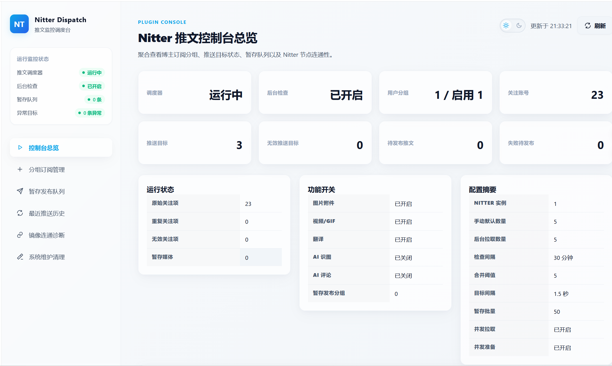
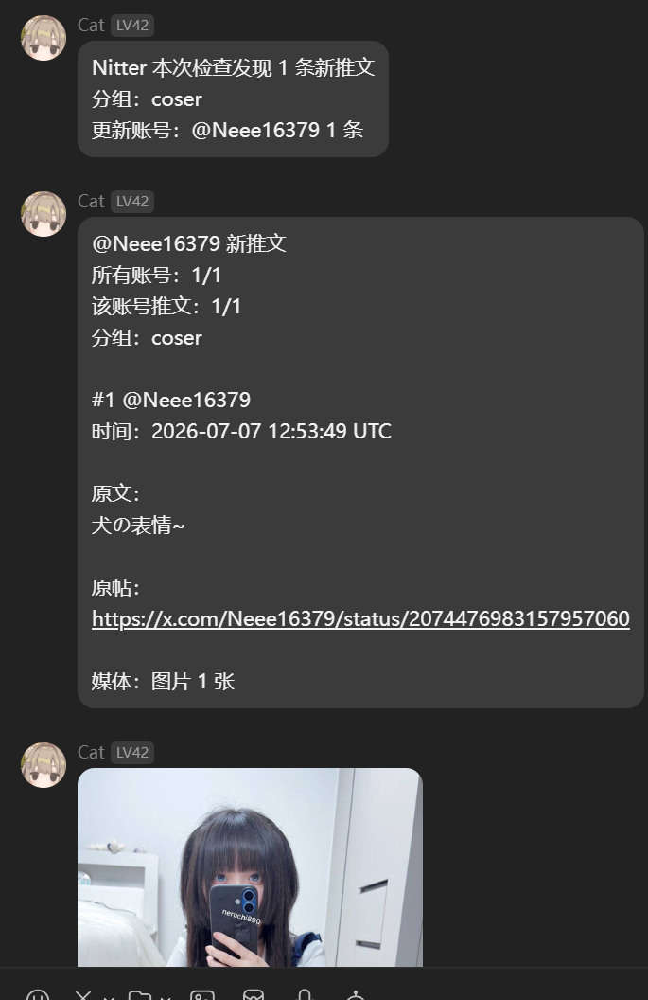
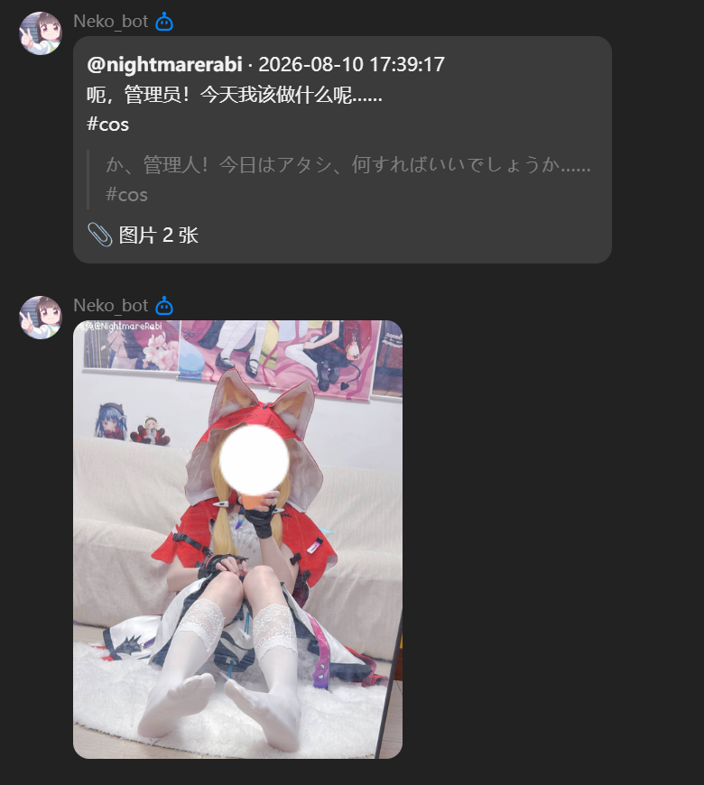

# 推文订阅

<p align="center">
  <a href="https://github.com/shitianyaa/astrbot_plugin_nitter_tweets/releases"></a>
  <a href="https://github.com/shitianyaa/astrbot_plugin_nitter_tweets/blob/main/LICENSE"></a>
  <a href="https://github.com/Soulter/AstrBot"></a>
  
  <br />
  <a href="https://github.com/shitianyaa/astrbot_plugin_nitter_tweets/stargazers"></a>
  <a href="https://github.com/shitianyaa/astrbot_plugin_nitter_tweets"></a>
  <a href="https://qm.qq.com/q/cPQnFNtdN6"></a>
  <br />
  
  <br />
  
</p>

通过 Nitter 获取公开 X/Twitter 推文：手动查询与搜索、可选链接解析、按分组定时推送、图片/视频与翻译。兼容 AstrBot `>=4.26.0`。

> 首页只保留**上手与定位**。边界行为、平台差异、完整配置见 [进阶说明](./docs/advanced.md)。

## 目录

- [预览](#预览)
- [能做什么](#能做什么)
- [5 分钟上手](#5-分钟上手)
- [一键部署 Nitter](#一键部署-nitter)
- [常用命令](#常用命令)
- [常用配置](#常用配置)
- [常见问题](#常见问题)
- [文档导航](#文档导航)
- [致谢](#致谢)
- [许可证](#许可证)
- [免责声明](#免责声明)

## 预览

<p align="center">
  
</p>

<div align="center">
  <table>
    <tr>
      <td align="center">
        
        <br/>
        <sub>OneBot（普通直发）</sub>
      </td>
      <td align="center">
        
        <br/>
        <sub>QQ Official（官方 Markdown）</sub>
      </td>
    </tr>
  </table>
</div>

更多界面说明见 [进阶说明 · WebUI](./docs/advanced.md#webui-运维面板)。

## 能做什么

| 场景 | 能力 |
| --- | --- |
| 手动 | `/推文`、`/推文搜索`、`/镜像测试` |
| 链接 | 可选被动解析聊天中的 status 链接（默认关） |
| 定时 | `tweet_groups`：`blogger` / `tag` / `list` 分组推送 |
| 发送 | 私人号 OneBot 合并转发；QQ Official 正文使用官方 Markdown API，媒体独立发送；Telegram / Lark / 微信 OC 等普通发送；Telegram 推文链接保留但不展开网页预览 |
| 媒体与 AI | 图片；可选视频/GIF、翻译 |
| 运维 | WebUI 面板、失败历史与手动重推、缓存与推送记录清理 |

## 5 分钟上手

### 1. 先试命令

```text
/推文 nasa
/推文搜索 #标签
/镜像测试 https://your-nitter.example.com
```

数量可省略（用 `default_limit`）。`/镜像测试` 仅管理员。说明与边界见 [进阶说明](./docs/advanced.md)。

### 2. 最小后台推送

```text
schedule_enabled = true
tweet_groups:
  - name: 默认分组
    group_id: default
    group_type: blogger
    watch_users: NASA, BBCWorld
    push_targets: aiocqhttp:GroupMessage:123456
```

必知（3 条）：

1. 在目标会话发 `/sid`，把**完整 UMO** 填进 `push_targets`
2. `group_type` 与字段对应：`blogger`→`watch_users`，`tag`→`watch_queries`，`list`→`watch_lists`（勿混用）
3. **首次只记 seen，不推历史**

标签 / List 示例、风险与调度细节：[进阶说明](./docs/advanced.md) · [List 指南](./docs/twitter-lists.md)。**新建不久的 List 要过段时间才会被 Nitter 收录**，空结果先等再查。

### 3. 可选

| 需求 | 做法 |
| --- | --- |
| 聊天里自动解析推文链接 | 打开 `auto_parse_tweet_links_enabled` |
| 批量把关注加入 Public List | 见 [List 指南](./docs/twitter-lists.md)（第三方扩展；X 约 24h ~100 次量级限额） |
| WebUI 管分组 / 历史 / 实例诊断 | AstrBot 插件页「Nitter 推文面板」 |

### 推送目标示例

```text
aiocqhttp:GroupMessage:123456
qq_official:GroupMessage:group-openid
telegram:GroupMessage:-1001234567890
lark:GroupMessage:oc_xxxxxxxxxxxxx
```

QQ Official 群主动推送需要 AstrBot `>=4.26.0`。正文 Markdown 主动发送直接使用官方 `group_openid` 接口，不依赖 AstrBot 的群场景缓存；图片、视频仍由 AstrBot 负责上传和发送，具体媒体能力以适配器为准。

以 `/sid` 返回为准，不要手猜平台 ID。

## 一键部署 Nitter

由于公共 Nitter 实例已不再作为可靠依赖，建议先在 Linux VPS 上使用 [nitter-installer](https://github.com/shitianyaa/nitter-installer) 部署自建实例。该脚本使用 Docker Compose 编排 Nitter 和 Redis，并可选配置端口、域名、Nginx 反代、代理和账号凭证：

```bash
curl -fsSL https://raw.githubusercontent.com/shitianyaa/nitter-installer/main/nitter.sh -o nitter.sh && chmod +x nitter.sh && ./nitter.sh
```

部署完成后，将 Nitter 地址填入本插件的 `instances`。同一列表同时用于用户 RSS、用户 HTML、搜索、List 和后台并发抓取。脚本会修改服务器上的 Docker、Nginx 和配置文件；执行远程脚本前请先阅读其源码，并按需限制 VPS 安全组的入站端口。

如果需要关注较多账号，建议在 Nitter 中建立 List，再使用插件的 List 分组订阅。List 时间线通常比逐个轮询用户页产生更少请求，更不容易触发实例的 429。RSS 和 HTML 共用 `retry_attempts`、`retry_delay_seconds`，无需分别调整两套参数。

实例地址按部署拓扑填写：AstrBot 与 Nitter 同一 Docker network 使用 `http://nitter:8080`；AstrBot 在容器、Nitter 在宿主机时使用宿主机可达地址（如 `http://host.docker.internal:8080`）；两者都在宿主机进程时可使用 `http://127.0.0.1:8080`；跨机器使用 Nitter 服务器的公网 IP 或域名。AstrBot 容器内的 `127.0.0.1` 只指向 AstrBot 容器本身。

只填写你自己控制且信任的 Nitter。插件允许访问本地、Docker 和私网 HTTP(S) 地址，并会继续访问实例响应中提供的媒体 URL 与重定向目标；请用 Docker network、防火墙和反向代理隔离 Redis、AstrBot/NapCat 管理面及其他内部服务。

> 资源说明：一次测试中，若只统计脚本和静态配置文件，观测到约 **10 MB**。这只是特定环境和版本下的静态文件观测值，不代表完整部署的磁盘或内存占用；Docker 镜像、Redis 数据、日志、缓存、系统依赖和 Nginx 都会额外占用资源。实际用量请在 VPS 上用 `du -sh ~/nitter`、`docker system df` 和 `free -h` 自行确认。

## 常用命令

| 命令 | 权限 | 说明 |
| --- | --- | --- |
| `/推文 用户名 [数量]` | 普通 | 查公开用户最近推文 |
| `/推文搜索 关键词 [数量]` | 普通 | HTML 搜索；标签请带 `#` |
| `/镜像测试 … 实例URL` | 管理员 | 临时测试一个自建 Nitter 实例（RSS 优先，HTML 自动后备） |
| `/推文状态` | 管理员 | 调度与分组状态 |
| `/推文检查 [分组名]` | 管理员 | 立即检查（当前会话须在该组 `push_targets`） |
| `/推文黑名单 添加/删除/查看` | 管理员 | 按当前或指定 UMO 维护跨分组共享的作者黑名单 |
| `/推文缓存清理` | 管理员 | 清媒体缓存 |
| `/推文记录清理 确认` | 管理员 | 清推送记录 |
| `/订阅导入` `/订阅删除` `/订阅列表` `/订阅导出` `/订阅去重` | 管理员 | 博主订阅 |
| `/标签导入` `/标签删除` | 管理员 | 标签订阅（须带分组名） |

List 通过配置文件或 WebUI 添加 ID，暂无导入命令。

## 常用配置

完整默认值与 WebUI 文案见 [`_conf_schema.json`](./_conf_schema.json)。只列最常改的：

| 配置 | 说明 |
| --- | --- |
| `instances` | 唯一 Nitter 实例列表，同时用于用户 RSS/HTML、搜索、List 和后台并发抓取 |
| `default_limit` | 手动命令默认条数 |
| `schedule_enabled` | 后台检查总开关 |
| `push.target_blocked_users` | 按完整 UMO 保存作者黑名单；命令和 Dashboard 维护，跨分组共享 |
| `tweet_groups` | 订阅与推送分组 |
| `filter_reposts_enabled` | 后台转发过滤（全局；分组还有子开关） |
| `auto_parse_tweet_links_enabled` | 被动解析推文链接，默认关 |
| `brief_log_enabled` | 后台日志简略模式；开启时输出结构化检查摘要和关键失败信息 |
| `omit_status_url` | 定时推送是否省略原文链接；关闭时仍会清理当前 Nitter 镜像改写出的同站链接 |
| `send_image_attachments` / `send_video_attachments` | 图 / 视频是否发送 |
| `media_transport_base64_max_mb` | 允许走 base64 的单文件上限，默认 8；默认值已把绝大多数视频排除在外 |
| `translate_enabled` | 是否翻译 |
| `merge_tweet_threshold` | 私人号 OneBot 合并转发条数阈值；QQ Official 不使用该阈值；`0` 关 |

实例架构与容错：[实例配置指南](./docs/instances-guide.md)。

## 常见问题

以下规则容易混淆，完整说明见 [常见问题](./docs/faq.md)：

- 作者黑名单属于完整推送目标 UMO，同一目标跨分组共享。
- 历史重推属于原分组，只能选择该分组当前目标，不自动套用目标黑名单。
- seen 按分组和订阅源隔离，但同一分组内的多个推送目标共享 seen。
- 发送调用失败会停止自动重试并写失败历史；发送前准备失败仍保留重试机会。

## 文档导航

| 文档 | 内容 |
| --- | --- |
| [进阶说明](./docs/advanced.md) | 平台、流程、全配置、行为边界、诊断 |
| [常见问题](./docs/faq.md) | 黑名单、历史重推、seen、发送失败与水位 |
| [List 订阅](./docs/twitter-lists.md) | Public List、导入关注、故障排查 |
| [实例指南](./docs/instances-guide.md) | 容器地址、统一实例、协议行为与可信来源提醒 |
| [文档索引](./docs/README.md) | 全部 docs 入口 |
| [CHANGELOG](./CHANGELOG.md) | 版本记录 |
| [`_conf_schema.json`](./_conf_schema.json) | 配置真源 |

## 致谢

- [astrbot_plugin_parser](https://github.com/Zhalslar/astrbot_plugin_parser)、[Nitter](https://github.com/zedeus/nitter)、[xdown.app](https://xdown.app/)、[AstrBot](https://github.com/Soulter/AstrBot)
- [count.getloli.com](https://count.getloli.com/)：提供 README 猫猫计数图片
- 感谢 [tutianyu101](https://github.com/tutianyu101) 参与新版本测试
- 图标风格参考 [PeeGayhub 表情包](https://t.me/addstickers/PeeGayhub)；素材由 GPT 生成

## 许可证

MIT，见 [LICENSE](./LICENSE)。

## 免责声明

仅用于公开可见推文的获取与转发。请遵守 X/Twitter、Nitter 实例、xdown 与各消息平台的服务条款与速率限制。不提供绕过访问控制或抓取非公开内容的能力。
