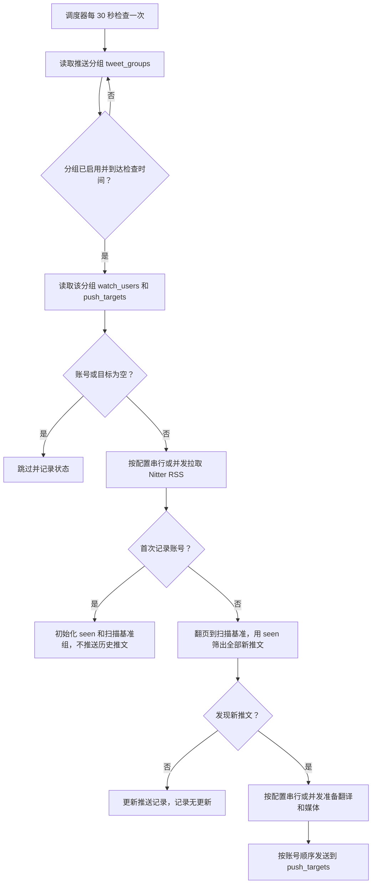
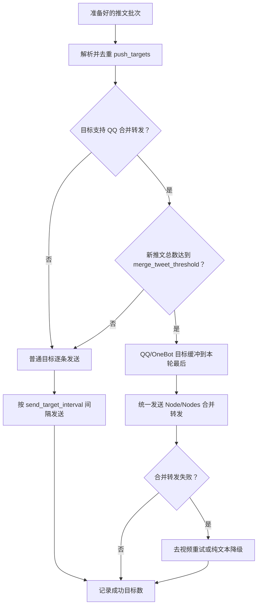
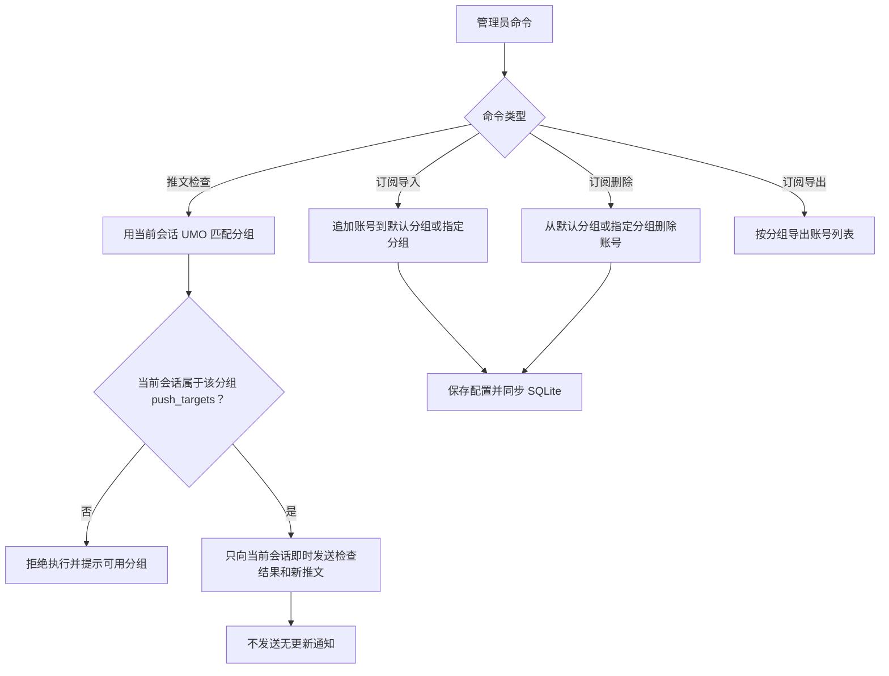

# Nitter 推文记录进阶说明

本文承接 README 中不适合放在首页的细节：平台差异、工作流程、完整配置参考、缓存、推送记录和本地诊断。

- 返回 [README](../README.md)
- 查看完整默认值：[_conf_schema.json](../_conf_schema.json)

## 平台支持

| 平台 | 适配器类型 | 特殊要求/说明 |
| --- | --- | --- |
| QQ | `aiocqhttp` / OneBot-like | 支持文本、图片、视频拆分和 OneBot v11 `Node/Nodes` 合并转发；合并转发失败时会按规则降级重试。 |
| Feishu / Lark | `lark` | 普通逐账号发送；优先使用飞书原生 `post` 将正文和本地图片放在同一条消息中，失败时降级为 `text` 正文加普通媒体附件。 |
| Telegram | `telegram` | 走 AstrBot 通用消息链发送；在群聊中使用前建议确认 BotFather 隐私模式和群内权限。 |
| 微信 OC | `weixin_oc` | 走 AstrBot 通用消息链发送；媒体附件是否可用取决于微信 OC 适配器的上传能力、会话 token 和平台限制。 |
| 其他平台 | default | 走 AstrBot 通用消息链发送；不使用 QQ 式合并转发。 |

推送目标应使用 `/sid` 返回的完整 UMO。UMO 第一段是平台实例 ID，不一定等于真实平台类型；插件会结合 AstrBot 平台 metadata 和平台能力识别 OneBot-like 目标。

## 工作流程

手动 `/推文搜索` 默认按 **会话 id**（优先 UMO）+ 查询词缓存本轮拉到的全部结果：每次只发送用户请求的条数，剩余留在内存缓冲；不足时再翻页拉取。缓冲约 10 分钟，进程重启清空。与定时标签 seen 隔离。


后台调度流程概览



### 多目标发送



### 手动检查与订阅维护



## WebUI 运维面板

插件提供 AstrBot Plugin Pages 页面 `Nitter 推文面板`。这个页面用于日常查看和维护，不替代 AstrBot 设置页。

| 页面 | 作用 |
| --- | --- |
| `概览` | 查看调度器运行状态、后台检查总开关、用户分组、关注账号、推送目标、无效推送目标、功能开关、关键配置摘要和常见配置诊断。 |
| `分组订阅` | 左侧推送分组列表 + 右侧详情编辑；支持创建安全默认的新分组，编辑 `name`、`enabled`、`interval_check_enabled`、`daily_check_times`、`filter_plain_text_enabled`、`push_targets`，并继续支持导入和删除关注账号。 |
| `最近推送` | 查看成功送达历史，媒体附件部分失败会标记为“媒体失败”；默认近 50 条口径由分页筛选决定；支持按分组、博主和每页数量筛选，多个推送目标合并展示，可选择当前分组当前推送目标重新推送；可手动检测已推送但当前配置不存在的 `group_id`，确认后清理该分组运行数据。 |
| `镜像测试` | 使用临时 Nitter 镜像 URL 测试指定账号 RSS 抓取；要求完整 `http://` 或 `https://` 地址，不写入 `instances`，不写入推送记录。 |
| `缓存清理` | 清理普通媒体缓存或推送记录；推送记录清理不会删除关注账号、推送目标或媒体文件。 |

### WebUI 分组管理 v2

- `group_id` 只读展示，不支持在 WebUI 中修改。
- 默认分组不可删除；删除自定义分组时会同时清理该分组的推送记录。
- `最近推送` 中的失效分组检测只列出存在于推送历史、但当前 `tweet_groups` 不存在的 `group_id`；删除前需要确认，删除范围包括该 `group_id` 的推送历史和防重复推送记录。
- `check_interval_minutes` 仍是全局配置，分组编辑页只展示“继承全局”的有效值。
- `push_targets` 支持在分组详情里新增或删除；点击保存后写回当前分组配置。删除推送目标不会删除关注账号、媒体、推送记录或发送历史。“检测目标”只校验 UMO 格式、平台实例是否存在和是否支持合并转发，不会向目标发送消息。

WebUI 不编辑完整 `tweet_groups`，也不编辑 AI、媒体下载、Nitter 实例、并发与限流等配置。这些配置仍以 `_conf_schema.json` 对应的 AstrBot 设置页为准。

## 配置参考

AstrBot 设置界面已按“基础、媒体、AI 翻译、后台检查、推送目标与用户分组、并发与限流、日志设置”分组展示。旧版本扁平配置仍会兼容读取，并自动迁移到默认分组。

### 基础

| 配置 | 说明 |
| --- | --- |
| `instances` | Nitter 实例列表，建议把自建实例放在第一位。 |
| `storage_backend` | 存储后端；运行期固定使用本地 SQLite 数据库。旧 KV 推送记录只会在启动迁移时自动导入，不再作为运行后端。 |
| `request_timeout` | 单次 RSS 请求等待某个 Nitter 实例响应的最长秒数；同一实例初次请求失败后最多再重试 1 次，仍失败才尝试下一个实例。 |
| `default_limit` | 手动 `/推文` 和 `/镜像测试` 未填写数量时的默认获取条数；填写数量时不额外截断。 |
| `cooldown_seconds` | 同一会话同一用户的命令冷却时间。 |
| `user_agent` | 请求 Nitter RSS 时使用的 User-Agent。 |
| `filter_reposts_enabled` | 是否过滤博主转发他人的推文；默认开启。插件会比较 RSS item 主链接作者和订阅账号，博主自己发布的引用或评论推文仍会保留。 |

### 后台检查与推送

| 配置 | 说明 |
| --- | --- |
| `schedule_enabled` | 是否启用后台检查总开关；关闭时分组里的间隔检查开关和每日检查时间都不会触发。手动 `/推文检查` 是否允许执行主要看当前会话是否在对应分组的 `push_targets` 中。 |
| `tweet_groups` | 推送分组列表；新建默认分组使用 `default`，旧配置中已有的显式 `group_id`（包括 `global`）会保留；`global` / `全局` 仍可作为默认分组别名用于命令查找。 |
| `check_interval_minutes` | 全局间隔检查分钟数；启用后台检查总开关后，启用间隔检查的分组都会按这个间隔运行。 |
| `scheduled_fetch_limit` | 旧版兼容字段；后台扫描首屏固定按 20 条处理，默认值为 `20`，该字段不会改变运行时首屏数量。 |
| `notify_no_updates` | 无新推文或首次记录账号时是否发送检查摘要。 |
| `check_on_startup` | 插件启动后是否立即检查一次。 |

### 推送目标与用户分组

| 配置 | 说明 |
| --- | --- |
| `merge_tweet_threshold` | QQ/OneBot 新推文总数达到多少条时启用合并转发；`0` 关闭，默认 `2`。 |
| `send_target_interval` | 多个目标之间的发送间隔。 |
| `send_user_interval` | 多个账号之间的发送间隔。 |
| `tweet_groups` | 推送分组列表；新配置请在这里填写关注账号和推送目标。 |
| `watch_users` | 旧版兼容字段；启动后会迁移到默认分组，配置界面隐藏。 |
| `push_targets` | 旧版兼容字段；启动后会迁移到默认分组，配置界面隐藏。 |

### 推送分组字段

| 字段 | 说明 |
| --- | --- |
| `name` | 分组显示名称，也可用于 `/推文检查 分组名`。 |
| `group_id` | 分组存储 ID；新建默认分组使用 `default`，已有值会保留。旧配置缺失时，安全英文数字分组名会作为旧 ID 继承，否则自动补齐为 `group_N`。 |
| `enabled` | 是否启用该分组。 |
| `watch_users` | 该分组关注账号列表。 |
| `push_targets` | 该分组推送目标列表。 |
| `interval_check_enabled` | 是否让该分组参与全局间隔检查；只有 `schedule_enabled` 开启后才会触发。 |
| `daily_check_times` | 该分组每日检查时间列表，格式 `HH:MM`；只有 `schedule_enabled` 开启后才会触发。 |
| `filter_plain_text_enabled` | 是否过滤没有当前作者上传图片、视频或 GIF 的纯文本推文；只影响该分组的后台检查，手动 `/推文`、`/镜像测试` 不受影响。 |
| `media_only_enabled` | 是否只发送作者和成功准备的图片/视频/GIF；受全局媒体类型开关和 `max_media_per_tweet` 控制。全局媒体不可用时只在 WebUI 和日志提示，并自动回退完整内容。仅媒体有效时：`policy_skipped` 允许扫描基准推进，`transient_failure` / `no_candidate` 下轮重试且不写 seen；手动命令和历史重推不受影响。 |


### 媒体

| 配置 | 说明 |
| --- | --- |
| `send_image_attachments` | 是否发送图片附件；默认开启。 |
| `send_video_attachments` | 是否发送视频/GIF 附件；默认关闭，当前仍在优化，建议先只保留原帖链接。检测到视频/GIF 时会忽略图片附件，包括视频封面。 |
| `video_resolution_preference` | 视频分辨率偏好；默认 `highest`，也可填 `lowest`、`1280p`、`852p`、`568p` 等。 |
| `max_video_duration_minutes` | 视频/GIF 最长下载分钟数，范围 `1-8`；能读取到时长且超过上限时会跳过下载并保留原文链接。 |
| `max_media_per_tweet` | 单条推文最多发送多少个媒体。 |
| `media_timeout` | 媒体解析和下载超时秒数。 |
| `media_max_size_mb` | 单个媒体大小上限。 |
| `xdown_api_url` | Twitter/X 媒体解析 API。 |
| `media_user_agent` | 解析和下载媒体时使用的 User-Agent。 |

### AI

| 配置 | 说明 |
| --- | --- |
| `translate_enabled` | 是否翻译非中文推文。 |
| `translation_provider_id` | 翻译使用的大模型。 |
| `translate_min_chars` | 去掉链接和 `@` 后低于该长度的文本不翻译。 |
| `translate_max_chars` | 发送给翻译模型的单条推文最大字符数。 |
| `translate_chinese_ratio_threshold` | 中文字符占比低于该阈值时判定为需要翻译；日文假名、韩文会直接判定为需要翻译。 |
| `translate_prompt` | 翻译提示词，必须包含 `{text}`。 |

每条推文内部固定先完成翻译，再开始该条推文的媒体下载。

### 日志设置

| 配置 | 说明 |
| --- | --- |
| `brief_log_enabled` | 后台日志简略模式；默认开启。开启后正常流程只保留每轮检查的结果摘要、失败详情、推送成功率和关键 warning/error；关闭后输出详细处理过程日志。 |

`brief_log_enabled` 只影响 AstrBot 后台 logger 输出，不影响聊天消息、推送内容、命令返回或发送行为。

### 并发与限流

| 配置 | 说明 |
| --- | --- |
| `concurrent_fetch_enabled` | 是否启用后台账号 RSS 并发拉取，默认 `false`。只有同时满足本项开启、`concurrent_fetch_instances` 非空、`fetch_concurrency > 1` 时才会启用；任一条件不满足时完全走旧串行路径。 |
| `fetch_concurrency` | 同时拉取账号数，默认 `3`，范围 `1-8`。 |
| `concurrent_fetch_instances` | 后台并发拉取专用 Nitter 镜像池。只用于后台检查，不用于手动 `/推文` 或 `/镜像测试`；留空时不启用并发，也不会回退到基础配置里的 `instances`。建议只填写自建镜像，不建议对公共镜像高并发。 |
| `concurrent_prepare_enabled` | 是否启用后台媒体和模型并发准备，默认 `false`。开启后不同推文或账号批次可以并发准备；同一条推文内部仍先翻译、后下载媒体。 |
| `prepare_concurrency` | 同时准备的推文或账号批次数，默认 `2`，范围 `1-8`。按单条推文或账号批次并发准备。 |

并发拉取只使用 `concurrent_fetch_instances`。每个账号会按账号索引轮转首选镜像，避免所有账号先打同一个镜像；单个镜像遇到 SSL、HTTP 5xx、429、超时等临时错误时总请求尝试 3 次，仍失败才尝试专用池内下一个镜像。

并发拉取仍按账号配置顺序收集发现结果；并发准备则按每条推文实际完成准备的顺序进入普通目标发送，不再恢复输入顺序。串行路径按 RSS 返回顺序逐条准备和发送；每条推文内部仍先翻译、后下载媒体。QQ/OneBot 合并目标在准备结束后按完成顺序组包发送。

### 隐藏迁移字段

`_legacy_grouped_config_migrated`、`_default_group_config_migrated` 等字段用于内部迁移状态，不需要手动维护。

## 详细行为

- 首次启用某个账号时，会初始化当前 RSS 扫描到的 seen ID 和独立扫描基准组，不推送历史内容；即使首轮结果为空或全部被过滤，下一轮出现新推文时仍会正常发现。
- 后台检查保存上一轮首屏最多 20 个精确基准 ID，并用最近 300 条 seen ID 做逐条去重。当前首屏未命中基准组中的任意 ID 时才按 `Min-Id` 继续翻页；命中基准前所有未 seen 推文都在本轮发送，命中位置及其后的旧内容不参与比较。发送失败、分页未完成或直到安全上限仍未命中任何基准 ID 时不会推进基准组。
- 旧版顶层 `watch_users`、`push_targets` 和分组相关定时配置会自动迁移到 `default` 默认分组；`tweet_groups` 中的各推送分组会独立运行，并拥有独立的推送记录。
- `filter_reposts_enabled` 开启时，手动 `/推文`、`/镜像测试` 和后台推送都会过滤 RSS item 主链接作者不是当前订阅账号的内容。
- 转发过滤无法解析作者时会保留，避免误删；博主自己发布的引用或评论推文会保留。
- 被过滤的转发不会推送；完整扫描仍会把其 ID 纳入扫描边界，避免下轮重复处理。如果某一页全是转发且存在下一页游标，插件会继续翻页查找更旧原创。
- 后台检查推送的新推文会在本轮每个目标的第一条普通消息或合并转发头部显示批次概览：博主数、推文数和来源分组；概括只出现一次，不显示账号进度或推文序号。
- 同一个目标群同时属于多个分组时，消息按各分组自己的检查/发布流程发出，并通过“分组”行区分来源。
- 没有新推文时默认只写日志，不往目标会话发送消息。
- 普通 RSS 抓取会按 `instances` 配置顺序尝试；全部失败时日志会显示尝试数量和最后几个错误。
- 普通 RSS 抓取遇到 SSL EOF、HTTP 5xx、429 等临时错误时，同一实例初次请求失败后最多再重试 1 次；仍失败则按配置顺序尝试下一个实例。
- 后台并发拉取启用时只使用 `concurrent_fetch_instances`，不会回退到 `instances`；专用池内每个镜像总请求尝试 3 次，仍失败才尝试下一个专用镜像。
- 图片解析或下载失败时，推文文本和原始链接仍会发送。
- 推文正文里的普通链接会保留在原文位置；Nitter 改写出的 `piped.video` 会还原为 `youtu.be`。
- 翻译只处理去除 URL 后的正文，避免重复链接。
- 手动 `/推文` 会按单条推文处理：一条推文完成翻译和媒体下载后就发送这一条。
- 后台推送会先完成本轮账号发现，以便计算第一条概括；随后串行路径按 RSS 顺序逐条发送，并发准备路径按完成顺序发送。用户消息不显示“所有账号 x/总数”或“该账号推文 x/y”。
- QQ 合并转发由 `merge_tweet_threshold` 控制；达到阈值时 OneBot v11/`aiocqhttp` 使用 `Node/Nodes` 合并转发。
- QQ/OneBot 图片附件会从推文正文中拆出：普通直发先发正文再逐张发图，单张图片发送失败会重试一次，合并转发中图片会成为独立节点；非 QQ 平台仍按平台适配能力发送图文同消息。
- 如果主体文本或 post 已送达，但图片、视频/GIF 等媒体附件最终失败，插件会把该次历史标记为“媒体失败”，并保留错误摘要，方便在 WebUI 最近推送中手动重发。
- OneBot 合并转发单次推文较多时会按每批最多 8 条自动分批，避免大合并包漏节点。
- 分组“仅媒体”有效时，消息只包含 `@作者` 和已准备附件；正文、翻译、原帖链接、媒体 warning 和 AI 提示都不会进入消息。媒体准备结果：`ready` 发送；`policy_skipped`（全局禁用类型或大小/时长/分辨率/数量等策略排除）本轮不发送并允许扫描基准推进；`transient_failure` 与 `no_candidate`（解析后仍无候选）本轮不发送、不写 seen，下轮重试。
- OneBot 合并转发超时或网络回包状态不确定时，插件会按可能已送达处理，跳过降级重发，避免同一轮重复推送。
- 视频/GIF 附件发送默认关闭；关闭时会保留原帖链接并提示打开原文查看。
- 开启视频/GIF 附件后只会按 `video_resolution_preference` 下载一个分辨率；检测到视频/GIF 时会忽略所有图片附件，避免把视频封面当普通图片发送。
- 插件会尽量读取视频时长，超过 `max_video_duration_minutes` 时跳过下载；读不到时长时不会误拦截，仍按文件大小上限处理。
- 普通媒体文件会在本轮手动查询或后台推送发送流程结束后删除；如果同一轮要发送到多个目标，会等所有目标都处理完再删除。
- 翻译使用 AstrBot 的 `context.llm_generate(...)` 接口；模型输出质量和费用取决于所选 provider。

## 缓存与存储

普通媒体下载到 AstrBot 插件数据目录的 `cache/` 后只保留到本轮发送结束。升级到发送后删除策略时，插件会在启动阶段自动执行一次普通缓存清理。

`/推文缓存清理` 只清理普通缓存文件，会递归清理媒体缓存目录。

插件会把数据库文件保存到 AstrBot 插件数据目录的 `nitter_tweets.db`，用于存储分组配置、seen 去重 ID、每个账号的扫描基准组和 push history。seen 按 `group_id + username` 独立保留最近 300 个 ID，只用于判断推文是否已经成功送达；扫描基准组与 seen 分开维护，用于在首屏全是新内容时继续翻页到上次边界。push history 是另一套成功或部分失败的发送快照，供 WebUI 查看和重新推送，不参与新旧推文判断。手动 `/推文 用户名 数量` 查询不会写入 seen、扫描基准或 push history。

旧 KV seen 记录会在启动时自动导入 SQLite，导入后会删除旧 KV，避免卸载删除插件数据后重装又从旧 KV 恢复旧记录。取消订阅账号后不会立即删除其 seen 和扫描基准，超过 30 天仍未重新订阅的孤儿记录会在配置同步时清理；需要立即清空 seen 可使用 `/推文记录清理 确认`。push history 的孤儿分组由 WebUI 历史页面单独检测和删除。

## 本地诊断

```text
python scripts\probe_nitter_fetch.py nasa 5
python scripts\probe_nitter_fetch.py nasa 5 --include-reposts
```

脚本会复用插件的 Nitter RSS 抓取、分页和过滤逻辑。默认启用 `filter_reposts_enabled`；加 `--include-reposts` 后会临时关闭转发过滤，用于对比 Nitter RSS 原始返回。

`scripts/test_video_download.py` 可用于验证 xdown 解析、视频分辨率选择和最长下载时长：

```text
python scripts\test_video_download.py https://x.com/user/status/123 --resolution highest --max-duration-minutes 8
```

## 标签分组与 HTML 搜索（feat/tag-query-search）

### 分组类型

- `group_type: blogger`：只使用 `watch_users`，RSS 主路径；`user_html_fallback` 开启时 RSS 失败/空结果可回退 HTML 用户页（`blogger_html_instances`）。
- `group_type: tag`：只使用 `watch_queries`，仅 HTML `search_instances` 搜索；seen 账号键为 `q:<casefold query>`。
- 创建后类型不可改（WebUI 锁定）；不要在同一分组混用 users 与 queries。
- 标签首次空结果不初始化 seen，避免下一页刷屏。
- 管理命令：`/标签导入`、`/标签删除`；与 `/订阅导入`、`/订阅删除` 按类型互斥。

### 查询规则

- 前导 `#` → `type=tag`（保存时可补 `#`）；否则 `type=phrase`（禁止自动加 `#`）。
- 运行时优先信存盘 `type`；tag 可回退 `/hashtag/`，phrase 仅 `/search`。
- 手动：`/推文搜索 <query> [数量]`，冷却 `search_cooldown_seconds`，默认/最大条数见 `search_default_limit` / `search_max_limit`。

### 实例列表

| 列表 | 用途 |
|------|------|
| `instances` | 博主 RSS |
| `blogger_html_instances` | 博主 HTML 回退 |
| `search_instances` | 搜索 HTML（不要放 nitter.net） |

HTML 全局串行节流；429 冷却约 30s 起、封顶 5 分钟。Cookie 落在插件数据目录 `html_sessions/`。

## RSS 重试与本轮跳过（第二刀）

- `retry_attempts` / `retry_delay_seconds`：全局 basic 配置，默认 2 / 5s。
- 一次定时检查或一次手动 `/推文` 期间，若某 RSS 镜像出现 429/可重试失败，本轮后续账号跳过该 host；检查结束即丢弃（不写盘、不跨 tick）。
- HTML 搜索限流仍用 `html_backend` 的 host 冷却（30s 起、封顶 5min），并已加线程锁。

### 翻译与原文

分组可开 `hide_original_when_translated`：全局 AI 翻译开启且该条有译文时，只发「翻译」块、隐藏「原文」；无译文时仍发原文。仅媒体模式不调用翻译，本项无效。

### 消息布局

- Telegram：首行为 ，正文/翻译在后续块中，避免与原文重复。
- 正文与译文中的 http(s) 会剥离；关闭「去除推文链接」时，非 TG 平台在底部保留「原文链接」行。
- 空正文显示「（无正文）」。有译文时「翻译」块在「原文」之前。
