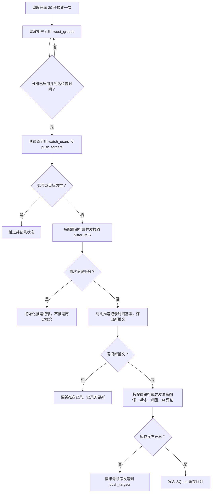
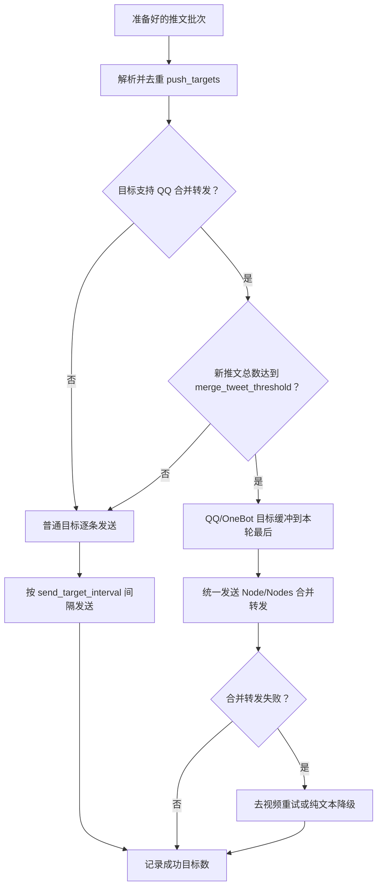
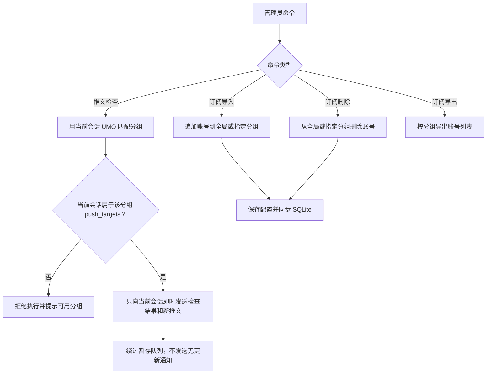

# Nitter 推文记录进阶说明

本文承接 README 中不适合放在首页的细节：平台差异、工作流程、完整配置参考、缓存、推送记录、暂存发布和本地诊断。

- 返回 [README](../README.md)
- 查看完整默认值：[_conf_schema.json](../_conf_schema.json)

## 平台支持

| 平台 | 适配器类型 | 特殊要求/说明 |
| --- | --- | --- |
| QQ | `aiocqhttp` / OneBot-like | 支持文本、图片、视频拆分和 OneBot v11 `Node/Nodes` 合并转发；合并转发失败时会按规则降级重试。 |
| Feishu / Lark | `lark` | 普通逐账号发送；优先使用飞书原生 `post` 将正文和本地图片放在同一条消息中，失败时降级为 `text` 正文加普通媒体附件。 |
| Telegram | `telegram` | 走 AstrBot 通用消息链发送；在群聊中使用前建议确认 BotFather 隐私模式和群内权限。 |
| 微信 OC | `weixin_oc` | 走 AstrBot 通用消息链发送；媒体附件是否可用取决于微信 OC 适配器的上传能力、会话 token 和平台限制。 |
| 其他平台 | default | 走 AstrBot 通用消息链发送；不使用 QQ 式合并转发。 |

推送目标应使用 `/sid` 返回的完整 UMO。UMO 第一段是平台实例 ID，不一定等于真实平台类型；插件会结合 AstrBot 平台 metadata 和平台能力识别 OneBot-like 目标。

## 工作流程

### 后台检查与推送



### 多目标发送



### 手动检查与订阅维护



## WebUI 运维面板

插件提供 AstrBot Plugin Pages 页面 `Nitter 推文面板`。这个页面用于日常查看和维护，不替代 AstrBot 设置页。

| 页面 | 作用 |
| --- | --- |
| `概览` | 查看调度器运行状态、后台检查总开关、用户分组、关注账号、推送目标、无效推送目标、暂存队列、功能开关、关键配置摘要和常见配置诊断。 |
| `分组订阅` | 左侧用户分组列表 + 右侧详情编辑；支持创建安全默认的新分组，编辑 `name`、`enabled`、`interval_check_enabled`、`daily_check_times`、`deferred_publish_enabled`、`filter_plain_text_enabled`、`push_targets`，并继续支持导入和删除关注账号。 |
| `暂存队列` | 查看各分组待发布推文、账号分布、失败数量、媒体数量、最早/最新入队时间、失败原因和已送达推送目标数量；支持按分组发布暂存队列。 |
| `最近推送` | 查看成功送达历史，默认近 50 条口径由分页筛选决定；支持按分组、博主和每页数量筛选，多个推送目标合并展示，可选择当前分组当前推送目标重新推送。 |
| `镜像测试` | 使用临时 Nitter 镜像 URL 测试指定账号 RSS 抓取；要求完整 `http://` 或 `https://` 地址，不写入 `instances`，不写入推送记录。 |
| `缓存清理` | 清理普通媒体缓存或推送记录；媒体缓存清理会保留 `cache/staged/` 暂存媒体，推送记录清理不会删除关注账号、推送目标、暂存队列或媒体文件。 |

### WebUI 分组管理 v2

- `group_id` 只读展示，不支持在 WebUI 中修改。
- 默认分组不可删除；删除自定义分组时会同时清理该分组的推送记录、暂存队列和 `cache/staged/<group_id>/` 暂存媒体。
- `check_interval_minutes` 和 `deferred_publish_times` 仍是全局配置，分组编辑页只展示“继承全局”的有效值。
- `push_targets` 支持在分组详情里新增或删除；点击保存后写回当前分组配置。删除推送目标不会删除关注账号、暂存队列、媒体、推送记录或发送历史。“检测目标”只校验 UMO 格式、平台实例是否存在和是否支持合并转发，不会向目标发送消息。

WebUI 不编辑完整 `tweet_groups`，也不编辑 AI、媒体下载、Nitter 实例、并发与限流等配置。这些配置仍以 `_conf_schema.json` 对应的 AstrBot 设置页为准。

## 配置参考

AstrBot 设置界面已按“基础、媒体、AI 翻译、AI 评论、AI 识图、后台检查、暂存发布、推送目标与用户分组、并发与限流、日志设置”分组展示。旧版本扁平配置仍会兼容读取，并自动迁移到默认分组。

### 基础

| 配置 | 说明 |
| --- | --- |
| `instances` | Nitter 实例列表，建议把自建实例放在第一位。 |
| `storage_backend` | 存储后端；运行期固定使用本地 SQLite 数据库。旧 KV 推送记录只会在启动迁移时自动导入，不再作为运行后端。 |
| `request_timeout` | 单次 RSS 请求等待某个 Nitter 实例响应的最长秒数；同一实例初次请求失败后最多再重试 1 次，仍失败才尝试下一个实例。 |
| `default_limit` | 手动 `/推文` 和 `/镜像测试` 未填写数量时的默认获取条数；填写数量时不额外截断。 |
| `cooldown_seconds` | 同一会话同一用户的命令冷却时间。 |
| `user_agent` | 请求 Nitter RSS 时使用的 User-Agent。 |
| `filter_reposts_enabled` | 是否过滤博主转发他人的推文；默认开启。插件会比较 RSS item 主链接作者和订阅账号，博主自己发布的引用或评论推文仍会保留。 |

### 后台检查与推送

| 配置 | 说明 |
| --- | --- |
| `schedule_enabled` | 是否启用后台检查总开关；关闭时分组里的间隔检查开关和每日检查时间都不会触发。手动 `/推文检查` 是否允许执行主要看当前会话是否在对应分组的 `push_targets` 中。 |
| `tweet_groups` | 用户分组列表；新建默认分组使用 `default`，旧配置中已有的显式 `group_id`（包括 `global`）会保留；`global` / `全局` 仍可作为默认分组别名用于命令查找。 |
| `check_interval_minutes` | 全局间隔检查分钟数；启用后台检查总开关后，启用间隔检查的分组都会按这个间隔运行。 |
| `scheduled_fetch_limit` | 后台检查时每个账号最多保留多少条有效推文用于对比，默认 `5`，范围 `1-20`。RSS 抓取会按 `Min-Id` 游标翻页，直到攒够条数、没有下一页或遇到停止条件，不是固定只拉一页。 |
| `notify_no_updates` | 无新推文或首次记录账号时是否发送检查摘要。 |
| `check_on_startup` | 插件启动后是否立即检查一次。 |

### 推送目标与用户分组

| 配置 | 说明 |
| --- | --- |
| `merge_tweet_threshold` | QQ/OneBot 新推文总数达到多少条时启用合并转发；`0` 关闭，默认 `2`。 |
| `send_target_interval` | 多个目标之间的发送间隔。 |
| `send_user_interval` | 多个账号之间的发送间隔。 |
| `tweet_groups` | 用户分组列表；新配置请在这里填写关注账号和推送目标。 |
| `watch_users` | 旧版兼容字段；启动后会迁移到默认分组，配置界面隐藏。 |
| `push_targets` | 旧版兼容字段；启动后会迁移到默认分组，配置界面隐藏。 |

### 用户分组字段

| 字段 | 说明 |
| --- | --- |
| `name` | 分组显示名称，也可用于 `/推文检查 分组名`。 |
| `group_id` | 分组存储 ID；新建默认分组使用 `default`，已有值会保留，缺失时自动补齐。 |
| `enabled` | 是否启用该分组。 |
| `watch_users` | 该分组关注账号列表。 |
| `push_targets` | 该分组推送目标列表。 |
| `interval_check_enabled` | 是否让该分组参与全局间隔检查；只有 `schedule_enabled` 开启后才会触发。 |
| `daily_check_times` | 该分组每日检查时间列表，格式 `HH:MM`；只有 `schedule_enabled` 开启后才会触发。 |
| `deferred_publish_enabled` | 该分组是否启用暂存发布；发布时间和批量上限等使用全局暂存配置。 |

### 暂存定时发布

| 配置 | 说明 |
| --- | --- |
| `deferred_publish_times` | 暂存队列发布时间列表，格式 `HH:MM`。 |
| `deferred_publish_batch_limit` | 每次最多发布多少条暂存推文，默认 `50`。 |
| `deferred_prefetch_media` | 是否在暂存入队时预下载图片/视频到 `cache/staged/`。 |
| `deferred_media_retention_hours` | 暂存媒体保留小时数，用于清理长期未发布或失败重试遗留的媒体文件。 |
| `deferred_media_download_interval_seconds` | 暂存媒体预下载时每条推文之间的额外等待秒数，降低连续下载压力。 |

暂存发布是否对某个分组生效由该分组的 `deferred_publish_enabled` 决定；发布时间、每次发布上限、媒体预下载和清理策略由全局暂存配置决定。手动 `/推文检查` 会绕过暂存队列，只向当前会话即时发送本次新推文。

### 媒体

| 配置 | 说明 |
| --- | --- |
| `send_image_attachments` | 是否发送图片附件；默认开启。 |
| `send_video_attachments` | 是否发送视频/GIF 附件；默认关闭，当前仍在优化，建议先只保留原帖链接。检测到视频/GIF 时会忽略图片附件，包括视频封面。 |
| `video_resolution_preference` | 视频分辨率偏好；默认 `highest`，也可填 `lowest`、`1280p`、`852p`、`568p` 等。 |
| `max_video_duration_minutes` | 视频/GIF 最长下载分钟数，范围 `1-8`；能读取到时长且超过上限时会跳过下载并保留原文链接。 |
| `max_media_per_tweet` | 单条推文最多发送多少个媒体。 |
| `media_timeout` | 媒体解析和下载超时秒数。 |
| `media_max_size_mb` | 单个媒体大小上限。 |
| `xdown_api_url` | Twitter/X 媒体解析 API。 |
| `media_user_agent` | 解析和下载媒体时使用的 User-Agent。 |

### AI

| 配置 | 说明 |
| --- | --- |
| `translate_enabled` | 是否翻译非中文推文。 |
| `translation_provider_id` | 翻译使用的大模型。 |
| `translate_min_chars` | 去掉链接和 `@` 后低于该长度的文本不翻译。 |
| `translate_max_chars` | 发送给翻译模型的单条推文最大字符数。 |
| `translate_chinese_ratio_threshold` | 中文字符占比低于该阈值时判定为需要翻译；日文假名、韩文会直接判定为需要翻译。 |
| `translate_prompt` | 翻译提示词，必须包含 `{text}`。 |
| `comment_enabled` | 是否启用 AI 评论。 |
| `comment_provider_id` | AI 评论使用的大模型。 |
| `comment_probability` | 每条推文触发 AI 评论的概率，范围 `0-1`。 |
| `comment_max_chars` | 发送给评论模型的单条推文最大正文长度。 |
| `comment_prompt` | 评论提示词，可使用 `{text}`、`{translation}`、`{image_caption}`、`{link}`。 |
| `vision_enabled` | 是否启用 AI 识图。识图结果不单独显示，主要作为 AI 评论上下文。 |
| `vision_provider_id` | AI 识图使用的视觉模型。 |
| `vision_probability` | 每条推文触发 AI 识图的概率，范围 `0-1`。 |
| `vision_max_images` | 每条推文最多识别几张图片，范围 `1-12`。 |
| `vision_prompt` | 识图提示词。 |

AI 处理顺序为：翻译 -> 媒体下载 -> 识图 -> 评论。评论不会仅凭原文触发；必须先有翻译结果或识图结果，且 `comment_enabled=true`、评论 provider 可用、`comment_probability` 命中，才会调用评论模型。

### 日志设置

| 配置 | 说明 |
| --- | --- |
| `brief_log_enabled` | 后台日志简略模式；默认开启。开启后正常流程只保留每轮检查或暂存发布的结果摘要、失败详情、推送成功率和关键 warning/error；关闭后输出详细处理过程日志。 |

`brief_log_enabled` 只影响 AstrBot 后台 logger 输出，不影响聊天消息、推送内容、命令返回或发送行为。

### 并发与限流

| 配置 | 说明 |
| --- | --- |
| `concurrent_fetch_enabled` | 是否启用后台账号 RSS 并发拉取，默认 `false`。只有同时满足本项开启、`concurrent_fetch_instances` 非空、`fetch_concurrency > 1` 时才会启用；任一条件不满足时完全走旧串行路径。 |
| `fetch_concurrency` | 同时拉取账号数，默认 `3`，范围 `1-8`。 |
| `concurrent_fetch_instances` | 后台并发拉取专用 Nitter 镜像池。只用于后台检查，不用于手动 `/推文` 或 `/镜像测试`；留空时不启用并发，也不会回退到基础配置里的 `instances`。建议只填写自建镜像，不建议对公共镜像高并发。 |
| `concurrent_prepare_enabled` | 是否启用后台媒体和模型并发准备，默认 `false`。开启后会并发执行翻译、媒体下载、AI 识图和 AI 评论。 |
| `prepare_concurrency` | 同时准备的推文或账号批次数，默认 `2`，范围 `1-8`。即时推送模式按单条推文并发准备；暂存模式按账号批次并发准备。 |

并发拉取只使用 `concurrent_fetch_instances`。每个账号会按账号索引轮转首选镜像，避免所有账号先打同一个镜像；单个镜像遇到 SSL、HTTP 5xx、429、超时等临时错误时总请求尝试 3 次，仍失败才尝试专用池内下一个镜像。

并发只改变后台检查内部等待方式，不改变最终顺序。RSS 拉取可以乱序完成，但推送记录对比、新推文发现和失败记录按 `watch_users` 顺序消费；媒体、翻译、识图和评论可以乱序准备，但发送、暂存入队和推送记录更新仍按账号顺序以及推文从旧到新的顺序执行。

### 隐藏迁移字段

`_legacy_grouped_config_migrated`、`_default_group_config_migrated` 等字段用于内部迁移状态，不需要手动维护。

## 详细行为

- 首次启用某个账号时，只记录当前 RSS 中已有的推文 ID，不推送历史内容。
- 后台检查以推送记录中最大的数字推文 ID 作为时间基准；之后翻页或过滤才发现的更旧未知推文只会补入推送记录防重复，不会回填推送。
- 旧版顶层 `watch_users`、`push_targets` 和分组相关定时配置会自动迁移到 `default` 默认分组；`tweet_groups` 中的各用户分组会独立运行，并拥有独立的已见推文 ID。
- `filter_reposts_enabled` 开启时，手动 `/推文`、`/镜像测试` 和后台推送都会过滤 RSS item 主链接作者不是当前订阅账号的内容。
- 转发过滤无法解析作者时会保留，避免误删；博主自己发布的引用或评论推文会保留。
- 被过滤的转发不会写入推送记录；如果某一页全是转发且存在下一页游标，插件会继续翻页查找更旧原创。
- 后台检查和暂存发布推送的新推文会在本轮第一条普通消息或合并转发头部显示批次概览，包括来源分组、总新推文数和各账号条数。
- 同一个目标群同时属于多个分组时，消息按各分组自己的检查/发布流程发出，并通过“分组”行区分来源。
- 没有新推文时默认只写日志，不往目标会话发送消息。
- 普通 RSS 抓取会按 `instances` 配置顺序尝试；全部失败时日志会显示尝试数量和最后几个错误。
- 普通 RSS 抓取遇到 SSL EOF、HTTP 5xx、429 等临时错误时，同一实例初次请求失败后最多再重试 1 次；仍失败则按配置顺序尝试下一个实例。
- 后台并发拉取启用时只使用 `concurrent_fetch_instances`，不会回退到 `instances`；专用池内每个镜像总请求尝试 3 次，仍失败才尝试下一个专用镜像。
- 图片解析或下载失败时，推文文本和原始链接仍会发送。
- 推文正文里的普通链接会保留在原文位置；Nitter 改写出的 `piped.video` 会还原为 `youtu.be`。
- 翻译只处理去除 URL 后的正文，避免重复链接。
- 手动 `/推文` 会按单条推文处理：一条推文完成翻译、媒体下载、AI 识图和 AI 评论后就发送这一条。
- 后台推送会先完成本轮需要推送账号的发现，用于标题显示“所有账号 x/总数”；随后普通目标仍按账号顺序逐条处理和发送。启用并发拉取或并发准备后，这个最终顺序不变。
- QQ 合并转发由 `merge_tweet_threshold` 控制；达到阈值时 OneBot v11/`aiocqhttp` 使用 `Node/Nodes` 合并转发。
- QQ/OneBot 图片附件会从推文正文中拆出：普通直发先发正文再逐张发图，合并转发中图片会成为独立节点；非 QQ 平台仍按平台适配能力发送图文同消息。
- OneBot 合并转发单次推文较多时会按每批最多 8 条自动分批，避免大合并包漏节点。
- OneBot 合并转发超时或网络回包状态不确定时，插件会按可能已送达处理，跳过降级重发，避免同一轮重复推送。
- 视频/GIF 附件发送默认关闭；关闭时会保留原帖链接并提示打开原文查看。
- 开启视频/GIF 附件后只会按 `video_resolution_preference` 下载一个分辨率；检测到视频/GIF 时会忽略所有图片附件，避免把视频封面当普通图片发送。
- 插件会尽量读取视频时长，超过 `max_video_duration_minutes` 时跳过下载；读不到时长时不会误拦截，仍按文件大小上限处理。
- 普通媒体文件会在本轮手动查询或后台推送发送流程结束后删除；如果同一轮要发送到多个目标，会等所有目标都处理完再删除。
- 暂存发布开启时，后台检查发现的新推文会先进入 SQLite 队列；入队成功后立即写入推送记录，避免反复入队。
- 发布失败会保留队列和 `cache/staged/` 媒体供下次重试，发布成功后删除暂存媒体。
- 翻译、AI 评论、AI 识图都使用 AstrBot 的 `context.llm_generate(...)` 接口；模型输出质量和费用取决于所选 provider。

## 缓存与存储

普通媒体下载到 AstrBot 插件数据目录的 `cache/` 后只保留到本轮发送结束。升级到发送后删除策略时，插件会在启动阶段自动执行一次普通缓存清理。暂存媒体放在插件数据目录的 `cache/staged/<group_id>/<status_id>/`，发布成功后删除。

`/推文缓存清理` 只清理普通缓存文件，不会删除 `cache/staged/` 中等待发布的媒体；升级前遗留在插件源码目录 `cache/` 根目录下的普通媒体文件也会被尝试清理。

插件会把数据库文件保存到 AstrBot 插件数据目录的 `nitter_tweets.db`，用于存储分组配置、后台推送记录（内部字段名为 seen ID）和暂存队列。推送记录按 `group_id + username` 独立保留最近 300 条；手动 `/推文 用户名 数量` 查询不会写入推送记录。

旧 KV 推送记录会在启动时自动导入 SQLite，导入后会删除旧 KV，避免卸载删除插件数据后重装又从旧 KV 恢复旧记录。取消订阅账号后不会立即删除其推送记录，超过 30 天仍未重新订阅的孤儿推送记录会在配置同步时清理；需要立即清空可使用 `/推文记录清理 确认`。

## 本地诊断

```text
python scripts\probe_nitter_fetch.py nasa 5
python scripts\probe_nitter_fetch.py nasa 5 --include-reposts
```

脚本会复用插件的 Nitter RSS 抓取、分页和过滤逻辑。默认启用 `filter_reposts_enabled`；加 `--include-reposts` 后会临时关闭转发过滤，用于对比 Nitter RSS 原始返回。

`scripts/test_video_download.py` 可用于验证 xdown 解析、视频分辨率选择和最长下载时长：

```text
python scripts\test_video_download.py https://x.com/user/status/123 --resolution highest --max-duration-minutes 8
```
