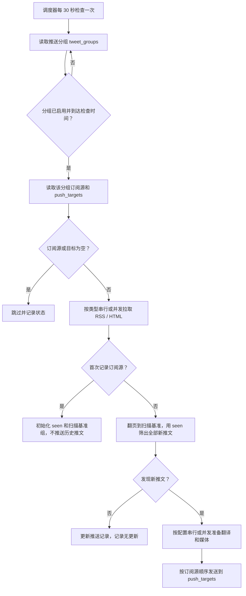
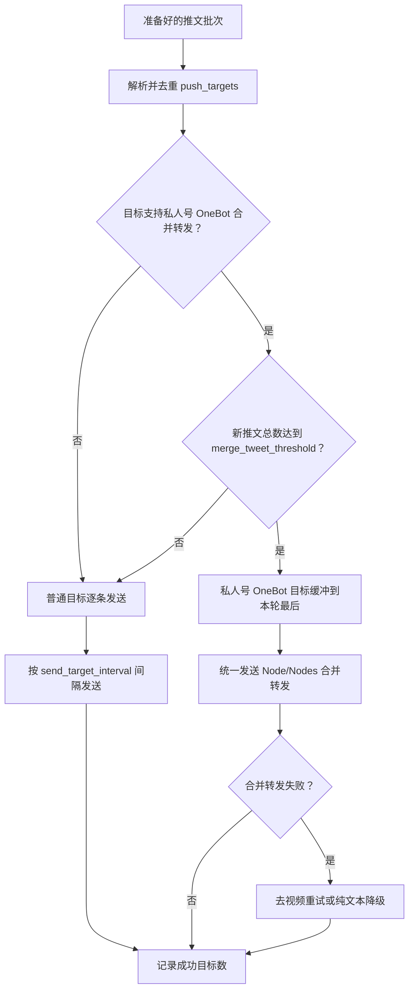
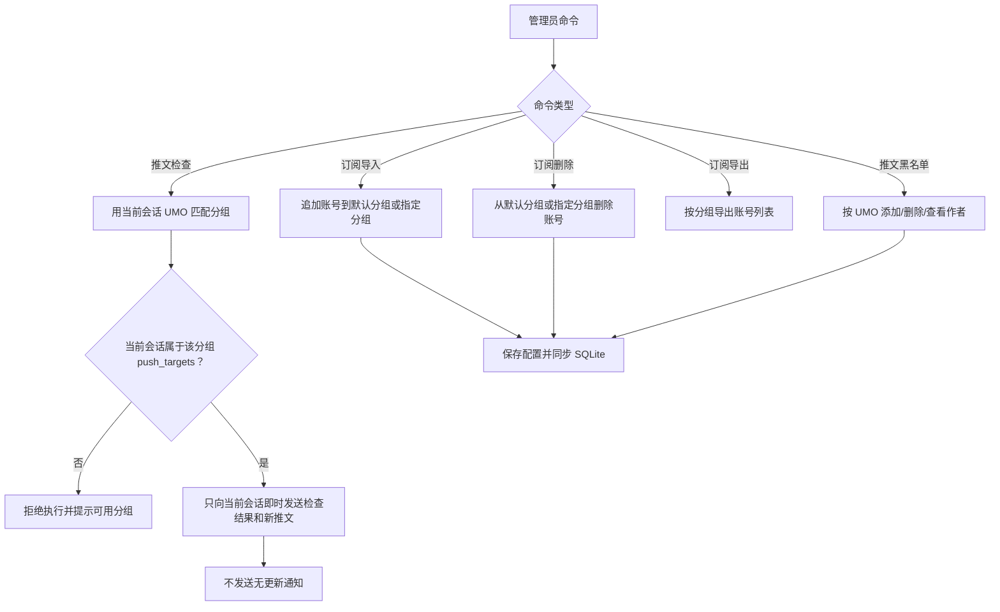

# Nitter 推文记录进阶说明

本文承接 README **不适合放在首页**的细节：平台差异、工作流程、完整配置、行为边界、缓存、推送记录和本地诊断。
README 只保留上手与定位；边界以本文与 `_conf_schema.json` 为准。

- 返回 [README](../README.md)
- 常见问题：[faq.md](./faq.md)
- 查看完整默认值：[_conf_schema.json](../_conf_schema.json)
- List 专题：[twitter-lists.md](./twitter-lists.md)
- 实例专题：[instances-guide.md](./instances-guide.md)

> 自建实例说明：当前版本不再提供公共 Nitter 默认地址。用户只需在 `instances` 中填写可信的自建 Nitter；该列表同时供用户 RSS/HTML、搜索、List 和后台并发抓取使用。已删除的旧实例字段只在启动时诊断，不会读取、迁移或写回。

## 平台支持

| 平台 | 适配器类型 | 特殊要求/说明 |
| --- | --- | --- |
| 私人号 OneBot | `aiocqhttp` / `onebot` / `onebot_v11` / `napcat` | 支持文本、图片、视频拆分和 OneBot v11 `Node/Nodes` 合并转发；合并转发失败时会按规则降级重试。 |
| QQ Official | `qq_official` / `qq_official_webhook` | 需要 AstrBot `>=4.26.0`；WebSocket 和 Webhook 两种官方适配器共用同一条投递路径。正文 Event/UMO 使用官方 Markdown，图片和视频独立发送；不使用私人号 OneBot 的 `Node/Nodes` 合并转发。 |
| Feishu / Lark | `lark` | 普通逐订阅源发送；优先使用飞书原生 `post` 将正文和本地图片放在同一条消息中，失败时降级为 `text` 正文加普通媒体附件。 |
| Telegram | `telegram` | 走 AstrBot 通用消息链发送；在群聊中使用前建议确认 BotFather 隐私模式和群内权限。 |
| 微信 OC | `weixin_oc` | 走 AstrBot 通用消息链发送；媒体附件是否可用取决于微信 OC 适配器的上传能力、会话 token 和平台限制。 |
| 其他平台 | default | 走 AstrBot 通用消息链发送；不使用 QQ 式合并转发。 |

推送目标应使用 `/sid` 返回的完整 UMO。UMO 第一段是平台实例 ID，不一定等于真实平台类型；插件优先使用 AstrBot 平台 metadata/config 类型，只在无法取得平台类型信息时才用 UMO 实例 ID 兜底。

QQ Official 群主动推送的 Markdown 正文直接使用官方 `group_openid` 接口，不依赖 AstrBot 适配器的运行期群会话场景缓存；图片、视频等媒体仍由 AstrBot 负责上传和发送。

## 工作流程

手动 `/推文搜索` 默认按 **会话 id**（优先 UMO）+ 查询词缓存本轮拉到的全部结果：每次只发送用户请求的条数，剩余留在内存缓冲；不足时再翻页拉取。缓冲约 10 分钟，进程重启清空。与定时标签 seen 隔离。


后台调度流程概览


```mermaid
flowchart TD
    A["调度器每 30 秒检查一次"] --> B["读取推送分组 tweet_groups"]
    B --> C{"分组已启用并到达检查时间？"}
    C -->|否| B
    C -->|是| D["读取该分组订阅源和 push_targets"]
    D --> E{"订阅源或目标为空？"}
    E -->|是| F["跳过并记录状态"]
    E -->|否| G["按类型串行或并发拉取 RSS / HTML"]
    G --> H{"首次记录订阅源？"}
    H -->|是| I["初始化 seen 和扫描基准组，不推送历史推文"]
    H -->|否| J["翻页到扫描基准，用 seen 筛出全部新推文"]
    J --> K{"发现新推文？"}
    K -->|否| L["更新推送记录，记录无更新"]
    K -->|是| M["按配置串行或并发准备翻译和媒体"]
    M --> O["按订阅源顺序发送到 push_targets"]
```

### 多目标发送


```mermaid
flowchart TD
    A["准备好的推文批次"] --> B["解析并去重 push_targets"]
    B --> C{"目标支持私人号 OneBot 合并转发？"}
    C -->|否| D["普通目标逐条发送"]
    C -->|是| E{"新推文总数达到 merge_tweet_threshold？"}
    E -->|否| D
    E -->|是| F["私人号 OneBot 目标缓冲到本轮最后"]
    D --> G["按 send_target_interval 间隔发送"]
    F --> H["统一发送 Node/Nodes 合并转发"]
    H --> I{"合并转发失败？"}
    I -->|否| J["记录成功目标数"]
    I -->|是| K["去视频重试或纯文本降级"]
    K --> J
    G --> J
```

### 手动检查与订阅维护


```mermaid
flowchart TD
    A["管理员命令"] --> B{"命令类型"}
    B -->|推文检查| C["用当前会话 UMO 匹配分组"]
    C --> D{"当前会话属于该分组 push_targets？"}
    D -->|否| E["拒绝执行并提示可用分组"]
    D -->|是| F["只向当前会话即时发送检查结果和新推文"]
    F --> G["不发送无更新通知"]
    B -->|订阅导入| H["追加账号到默认分组或指定分组"]
    B -->|订阅删除| I["从默认分组或指定分组删除账号"]
    B -->|订阅导出| J["按分组导出账号列表"]
    B -->|推文黑名单| L["按 UMO 添加/删除/查看作者"]
    H --> K["保存配置并同步 SQLite"]
    I --> K
    L --> K
```

## WebUI 运维面板

插件提供 AstrBot Plugin Pages 页面 `Nitter 推文面板`。这个页面用于日常查看和维护，不替代 AstrBot 设置页。

| 页面 | 作用 |
| --- | --- |
| `概览` | 分别查看博主订阅、搜索订阅和 List 数量，以及重复/无效订阅、无效推送目标和全局配置诊断。 |
| `分组订阅` | 左侧推送分组列表 + 右侧详情编辑；支持创建博主、标签或列表分组，编辑 `name`、`enabled`、`interval_check_enabled`、`daily_check_times`、`filter_reposts_enabled`、`filter_plain_text_enabled`、`push_targets` 和对应的 `watch_users`、`watch_queries`、`watch_lists`。类型创建后不可修改；每个目标下还可维护跨分组共享的作者黑名单。 |
| `最近推送` | 查看成功、部分送达或发送失败历史；默认每页 10 条，最多 50 条；支持按分组、订阅源和每页数量筛选，多个推送目标合并展示，可选择当前分组当前推送目标重新推送；可手动检测已推送但当前配置不存在的 `group_id`，确认后清理该分组运行数据。 |
| `实例测试` | 管理员一次检查统一 `instances` 中每个自建 Nitter 的用户 RSS、用户 HTML、搜索和可选 List 能力；URL 留空测试全部实例，填写 URL 只测试该站。不写入配置或推送记录。 |
| `缓存清理` | 清理普通媒体缓存或推送记录；推送记录清理不会删除关注账号、推送目标或媒体文件。 |

### WebUI 分组管理 v2

- `group_id` 只读展示，不支持在 WebUI 中修改。
- 默认分组不可删除；删除自定义分组时会同时清理该分组的推送记录。
- `最近推送` 中的失效分组检测只列出存在于推送历史、但当前 `tweet_groups` 不存在的 `group_id`；删除前需要确认，删除范围包括该 `group_id` 的推送历史和防重复推送记录。
- `check_interval_minutes` 仍是全局配置，分组编辑页只展示“继承全局”的有效值。
- `push_targets` 支持在分组详情里新增或删除；点击保存后写回当前分组配置。删除推送目标不会删除关注账号、媒体、推送记录或发送历史。“检测目标”只校验 UMO 格式、平台实例是否存在和是否支持合并转发，不会向目标发送消息。
- 目标作者黑名单按完整 UMO 归属，不属于某个 `tweet_group`；同一目标出现在多个分组时规则通用。Dashboard 可在目标下添加/删除用户名，命令 `/推文黑名单 添加 用户名`、`/推文黑名单 删除 用户名`、`/推文黑名单 查看` 默认使用当前会话目标，也可把 UMO 作为第一个参数。目标参数支持完整 UMO（如 `aiocqhttp:GroupMessage:123`）以及 `group:123` / `private:123` 简写；裸数字不会被视为目标，以免与数字用户名混淆。匹配按用户名精确且大小写不敏感，只影响后台分组推送；手动查询、被动链接预览和历史重推不自动套用。
- 列表分组只接受正 `uint64` List ID。前端会检查 1-20 位纯数字及当前草稿/已有配置中的重复值；后端还会拒绝 `0` 和超过 `18446744073709551615` 的值。
- `check_on_startup=true` 时，调度存储初始化完成后按分组顺序首检所有启用且同时配置订阅源和有效推送目标的分组；仅每日检查、仅间隔检查和没有定时槽位的分组都包含在首检范围内。缺少订阅源或目标的分组只记录跳过日志。

WebUI 不编辑完整 `tweet_groups`，也不编辑 AI、媒体下载、Nitter 实例、并发与限流等配置。这些配置仍以 `_conf_schema.json` 对应的 AstrBot 设置页为准。

## 配置参考

AstrBot 设置界面已按“基础、媒体、AI 翻译、后台检查、推送目标与订阅分组、并发与限流、日志设置”分组展示。旧版本扁平配置仍会兼容读取，并自动迁移到默认分组。

### 基础

| 配置 | 说明 |
| --- | --- |
| `instances` | 自建 Nitter 实例列表，同时用于 RSS、HTML 搜索和 List；默认空，必须由用户填写。 |
| `storage_backend` | 存储后端；运行期固定使用本地 SQLite 数据库。旧 KV 推送记录只会在启动迁移时自动导入，不再作为运行后端。 |
| `request_timeout` | 单次 RSS 请求等待某个 Nitter 实例响应的最长秒数；同一实例初次请求失败后最多再重试 1 次，仍失败才尝试下一个实例。 |
| `default_limit` | 手动 `/推文` 和 `/镜像测试` 未填写数量时的默认获取条数；填写数量时不额外截断。 |
| `cooldown_seconds` | 同一会话同一用户的命令冷却时间。 |
| `filter_reposts_enabled` | Blogger、Tag、List 后台转发过滤总开关，默认开启。只有总开关与分组同名子开关都开启时才过滤；全局关闭时所有分组保留转发。Blogger 会比较 RSS item 主链接作者和订阅源，博主自己发布的引用或评论推文仍会保留。手动命令不受分组开关影响。 |
| `auto_parse_tweet_links_enabled` | 是否被动解析聊天中的公开 X/Twitter status 链接，默认关闭。开启后无需命令；忽略 Bot 自身消息；翻译与「有译文时显示原文」跟随全局；不写 seen/push history；不受订阅、冷却和全局图/视频开关限制。同会话同帖约 60 秒防抖，单条消息最多 3 个不同链接。勿与同类链接解析插件同时开启以免重复回复。 |

插件对 RSS、HTML/List、状态解析、媒体解析和下载统一使用内置浏览器请求标识；User-Agent 不再作为配置项，避免不同请求链路使用互相冲突的身份。各协议所需的 `Accept`、`Referer`、`Origin` 和 `Content-Type` 仍分别设置。

### 后台检查与推送

| 配置 | 说明 |
| --- | --- |
| `schedule_enabled` | 是否启用后台检查总开关；关闭时分组里的间隔检查开关和每日检查时间都不会触发。手动 `/推文检查` 是否允许执行主要看当前会话是否在对应分组的 `push_targets` 中。 |
| `tweet_groups` | 推送分组列表；新建默认分组使用 `default`，旧配置中已有的显式 `group_id`（包括 `global`）会保留；`global` / `全局` 仍可作为默认分组别名用于命令查找。 |
| `check_interval_minutes` | 全局间隔检查分钟数；启用后台检查总开关后，启用间隔检查的分组都会按这个间隔运行。 |
| `scheduled_fetch_limit` | 旧版兼容字段；后台扫描首屏固定按 20 条处理，默认值为 `20`，该字段不会改变运行时首屏数量。 |
| `notify_no_updates` | 无新推文或首次建立订阅源基线时是否发送检查摘要。 |
| `check_on_startup` | 存储初始化完成后，是否按分组顺序首检所有启用且同时配置订阅源和有效推送目标的分组；包括仅每日定点、仅间隔和无定时槽位分组。首检完成后会锚定当前间隔和每日时间槽，避免同一轮重复触发。 |

### 推送目标与订阅分组

| 配置 | 说明 |
| --- | --- |
| `merge_tweet_threshold` | 私人号 OneBot 新推文总数达到多少条时启用合并转发；QQ Official 不使用该阈值；`0` 关闭，默认 `2`。 |
| `send_target_interval` | 同一订阅源发送到多个目标之间的发送间隔。 |
| `send_user_interval` | 多个订阅源之间的发送间隔；Tag/List 查询抓取也按该间隔串行等待。 |
| `manual_send_interval` | 手动 `/推文`、`/推文搜索`、`/镜像测试` 非合并转发时，逐条消息间隔（秒），默认 `0`；在平台适配前 sleep，多平台生效。 |
| `target_blocked_users` | `push` 下的隐藏列表配置，每项为完整目标 UMO 与其作者用户名列表；命令和 Dashboard 写入。抓取仍按分组统一扫描，发送阶段对每个目标分别过滤。目标 UMO 需完整格式（如 `aiocqhttp:GroupMessage:123`）。 |
| `tweet_groups` | 推送分组列表；新配置请在这里填写博主、搜索订阅或 List 以及推送目标。 |
| `watch_users` | 旧版兼容字段；启动后会迁移到默认分组，配置界面隐藏。 |
| `push_targets` | 旧版兼容字段；启动后会迁移到默认分组，配置界面隐藏。 |

### 推送分组字段

| 字段 | 说明 |
| --- | --- |
| `name` | 分组显示名称，也可用于 `/推文检查 分组名`。 |
| `group_id` | 分组存储 ID；新建默认分组使用 `default`，已有值会保留。旧配置缺失时，安全英文数字分组名会作为旧 ID 继承，否则自动补齐为 `group_N`。 |
| `enabled` | 是否启用该分组。 |
| `group_type` | `blogger`、`tag` 或 `list`；类型创建后不可修改。分别使用 `watch_users`、`watch_queries`、`watch_lists`。 |
| `watch_users` | Blogger 分组的博主订阅源列表。 |
| `watch_queries` | Tag 分组的搜索订阅列表；前导 `#` 为标签，否则为短语。 |
| `watch_lists` | List 分组的纯数字 List ID 列表。**刚创建不久的 List 往往要过一段时间才会被 Nitter 收录/搜到**，空结果时先等待再排查。详见 [twitter-lists.md](./twitter-lists.md)。 |
| `push_targets` | 该分组推送目标列表。 |
| `interval_check_enabled` | 是否让该分组参与全局间隔检查；只有 `schedule_enabled` 开启后才会触发。 |
| `daily_check_times` | 该分组每日检查时间列表，格式 `HH:MM`；只有 `schedule_enabled` 开启后才会触发。 |
| `send_target_interval` | 该分组多个目标之间的发送间隔（秒）；不设置则使用全局 `send_target_interval` 值。 |
| `send_user_interval` | 该分组多个订阅源之间的发送间隔（秒）；不设置则使用全局 `send_user_interval` 值。Tag/List 查询抓取之间也按该间隔等待。 |
| `max_tweets_per_check` | 单个订阅源单次检查最多推送的推文条数；`0`（默认）表示不限制，范围 0-200。适用于爆发式更新场景，避免一次推送过多消息。被截断的较旧推文会标记 seen，不会在下轮重新推送；Tag/List 扫描未完整且找不到旧基准时，`0` 会跳过推送并自动重建第一页基准，正数会按上限推送后再重建基准，旧积压可能被跳过。 |
| `filter_reposts_enabled` | 分组级转发过滤子开关，默认开启；仅在全局同名总开关开启时生效。旧分组缺少该字段时按开启处理。 |
| `filter_plain_text_enabled` | 是否过滤没有当前作者上传图片、视频或 GIF 的纯文本推文；只影响该分组的后台检查，手动 `/推文`、`/镜像测试` 不受影响。 |
| `media_only_enabled` | 是否只发送作者和成功准备的图片/视频/GIF；受全局媒体类型开关和 `max_media_per_tweet` 控制。全局媒体不可用时只在 WebUI 和日志提示，并自动回退完整内容。仅媒体有效时：`policy_skipped` 允许扫描基准推进，`transient_failure` / `no_candidate` 下轮重试且不写 seen；手动命令和历史重推不受影响。 |


### 媒体

| 配置 | 说明 |
| --- | --- |
| `send_image_attachments` | 是否发送图片附件；默认开启。 |
| `send_video_attachments` | 是否发送视频/GIF 附件；默认关闭。开启后可能受平台大小/格式限制；关闭时跳过视频下载。检测到视频/GIF 时会忽略图片附件（含封面）。 |
| `media_quality` | 媒体画质，图片和视频共用三档；默认 `high`（图片 twimg `name=orig`、视频取候选最高档），`medium`（图片 `name=large`、视频中位数档），`low`（图片 `name=small`、视频最低档）。图片档位对 HTML 抓取、xdown 兜底和 status 链接解析三条渠道统一生效（Nitter 实例自身的 `/pic/orig/media/...` 代理路径除外，那类 URL 不含 `pbs.twimg.com`，恒取实例提供的档）。 |
| `max_video_duration_minutes` | 视频/GIF 最长下载分钟数，范围 `1-8`；能读取到时长且超过上限时会跳过下载并保留原文链接。 |
| `max_media_per_tweet` | 单条推文最多发送多少个媒体。 |
| `media_timeout` | 媒体解析和下载超时秒数。 |
| `media_max_size_mb` | 单个媒体大小上限。 |
| `media_transport_mode` | 媒体交给协议端的编码策略，只影响私人号 OneBot。`auto`（默认）先试本地路径，失败再用 base64 重试；`base64_first` 直接从 base64 起步；`path_only` 只用本地路径。 |
| `media_transport_base64_max_mb` | 允许走 base64 的单文件上限，默认 8，范围 `0.5-32`。同时约束图片和视频——默认值已把绝大多数视频排除在 base64 之外。 |
| `media_transport_url_fallback` | 是否允许把 twimg 直链交给协议端自行下载；默认关闭。 |

#### 媒体传输编码

插件把媒体交给平台时默认使用本地文件路径，这要求 AstrBot 与协议端（NapCat / LLOneBot / Lagrange）
能读到同一个文件系统。分容器或分机器部署时协议端读不到 `file:///`，媒体会失败。

传输编码层为此提供一条**无损**的降级梯度，排在去视频、退纯文本这些**有损**降级之前：

| 类型 | `auto` 下的梯度 |
| --- | --- |
| 图片 | 本地路径 → base64 →（可选 URL 直传） |
| 视频 | 本地路径 →（可选 URL 直传）→ 放弃附件并保留「视频未发送」提示 |

- 视频只有小于 `media_transport_base64_max_mb` 时才会出现 base64 档。默认 8MB 意味着通常不走 base64——
  把几十 MB 的视频塞进单条消息会带来内存和 payload 压力。调高该值即表示接受这一开销。
- URL 直传默认关闭。开启后协议端会**直连 Twitter CDN**，绕过插件的代理配置并暴露其出口 IP；
  网络隔离的部署请保持关闭。带 token 的 xdown 直链时效短且对 Referer 敏感，任何时候都不会交给协议端。
- 传输层会记住每个平台最近一次成功的编码档作为下次的起步提示。如果你确定文件系统不共享，
  直接设 `base64_first` 可以省掉第一次的路径档试探。
- 超时等「可能已送达」的失败不会推进梯度，避免重复投递。

飞书、Telegram、QQ Official 和其他平台都在 AstrBot 进程内从本地路径上传，不存在这个问题，
也不参与该梯度。

### AI

| 配置 | 说明 |
| --- | --- |
| `translate_enabled` | 是否翻译非中文推文。 |
| `translation_provider_id` | 翻译使用的大模型。 |
| `translate_min_chars` | 去掉链接和 `@` 后低于该长度的文本不翻译。 |
| `translate_max_chars` | 发送给翻译模型的单条推文最大字符数。 |
| `translate_chinese_ratio_threshold` | 中文字符占比低于该阈值时判定为需要翻译；日文假名、韩文会直接判定为需要翻译。 |
| `translate_prompt` | 翻译提示词，必须包含 `{text}`。 |

每条推文内部固定先完成翻译，再开始该条推文的媒体下载。

### 日志设置

| 配置 | 说明 |
| --- | --- |
| `brief_log_enabled` | 后台日志简略模式；默认开启。开启后正常流程只保留每轮检查的结果摘要、失败详情、推送成功率和关键 warning/error；**同时收敛 HTML 过程日志**（见下）。关闭后输出详细处理过程日志。 |

`brief_log_enabled` 只影响 AstrBot 后台 logger 输出，不影响聊天消息、推送内容、命令返回或发送行为。

后台检查完成时会输出一条结构化任务摘要，包含分组、分组类型、订阅源、触发原因、生效实例、实例轮换轨迹、抓取状态、水位状态、纯文本/黑名单/媒体过滤统计、实际发送比、无效目标、基准重建、warning/error 明细和耗时。发送未完成、目标无效、基准重建或媒体待重试时使用 warning 级别；失败时优先看摘要，再按需关闭简略模式查看过程日志。

HTML 简略规则（`[NitterTweets][html]`，由 `QuietHtmlLog` 实现）：

- 始终抑制：`session load`（cookie 重载刷屏）
- 简略开启时再抑制：每次 `search/user/list try`、空页轮换过程行、冷却 skip/defer
- 简略仍保留：`punish`/冷却处罚、实例 fail、ok after rotate、empty after rotate 和页面错误

### 并发与限流

| 配置 | 说明 |
| --- | --- |
| `concurrent_fetch_enabled` | 是否启用后台账号 RSS 并发拉取，默认 `false`。开启且 `fetch_concurrency > 1` 时使用统一 `instances`；否则走串行路径。 |
| `fetch_concurrency` | 同时拉取账号数，默认 `3`，范围 `1-8`。 |
| `concurrent_prepare_enabled` | 是否启用后台媒体和模型并发准备，默认 `false`。开启后不同推文或账号批次可以并发准备；同一条推文内部仍先翻译、后下载媒体。 |
| `prepare_concurrency` | 同时准备的推文或账号批次数，默认 `2`，范围 `1-8`。按单条推文或账号批次并发准备。 |

并发拉取使用统一 `instances`。每个账号会按账号索引轮转首选实例，避免所有账号先打同一个实例；单个实例遇到 SSL、HTTP 5xx、429、超时等临时错误时总请求尝试 3 次，仍失败才尝试下一个实例。

并发拉取仍按账号配置顺序收集发现结果；并发准备则按每条推文实际完成准备的顺序进入普通目标发送，不再恢复输入顺序。串行路径按 RSS 返回顺序逐条准备和发送；每条推文内部仍先翻译、后下载媒体。私人号 OneBot 合并目标在准备结束后按完成顺序组包发送。

### 隐藏迁移字段

`_legacy_grouped_config_migrated`、`_default_group_config_migrated` 等字段用于内部迁移状态，不需要手动维护。

## 详细行为

### 推文链接自动解析

- 配置 `auto_parse_tweet_links_enabled=true` 后，消息中的 `x.com` / `twitter.com` status 链接会被被动解析。
- 忽略 Bot 自己发送的消息；开关关闭或未识别到合法链接时不 `stop_event`。
- 解析顺序：FxTwitter → VxTwitter → Syndication；媒体直链优先，缺失时 xdown 兜底。
- 强制准备图片/视频（无视全局图视频开关与 `max_media_per_tweet`），仍受大小、时长、超时限制。
- 翻译走现有 `TweetTranslator`；原文显隐仅看全局 `show_original_when_translated`（与手动一致，无分组覆盖）。
- 发送版式复用现有 Sender；正文布局 R1（译文为主文，原文 `>` 引用；无「翻译/原文」小标题）；默认 `omit_status_url=true`。
- 展示时间统一为 **Asia/Shanghai（UTC+8）** `YYYY-MM-DD HH:MM:SS`（RSS、链接解析、HTML 搜索/List、渲染兜底）。
- 同会话同 status 约 60 秒防抖（成功发送后记录）；单条消息最多 3 个不同链接。

- 首次启用某个订阅源时，会初始化当前扫描到的 seen ID 和独立扫描基准组，不推送历史内容；Tag/List 首轮边界见“Tag/List 分组与 HTML 搜索”。
- `check_on_startup=true` 时，存储迁移完成后会先按分组串行执行一次首检，再进入间隔/每日槽位轮询；首检日志始终包含分组、类型、订阅源数、目标数、触发原因、结果统计和耗时。缺少订阅源或目标的启用分组只记录明确跳过原因。
- 后台检查保存上一轮首屏最多 20 个精确基准 ID，并用最近 300 条 seen ID 做逐条去重。当前首屏未命中基准组中的任意 ID 时才按 `Min-Id` 继续翻页；命中基准前所有未 seen 推文都在本轮发送，命中位置及其后的旧内容不参与比较。Tag/List 在页数用尽仍未命中旧基准时，按 `max_tweets_per_check` 处理并在安全条件满足后自动用当前第一页基准重建；发送准备失败、基准无效或基准写入失败时保留旧水位，发送调用失败则按本轮跳过并推进 seen。
- 旧版顶层 `watch_users`、`push_targets` 和分组相关定时配置会自动迁移到 `default` 默认分组；`tweet_groups` 中的各推送分组会独立运行，并拥有独立的推送记录。
- Blogger、Tag、List 后台检查统一使用双层转发过滤：`实际过滤 = 全局 filter_reposts_enabled && 分组 filter_reposts_enabled`。全局和分组默认均开启，旧分组缺少子开关时按开启处理。
- 手动 `/推文`、`/镜像测试` 始终保留转发，便于完整查看镜像返回内容；`/推文搜索` 保持过滤纯转推，不读取分组开关。
- 转发过滤无法解析作者时会保留，避免误删；博主自己发布的引用或评论推文会保留。
- 被过滤的转发不会推送；完整扫描仍会把其 ID 纳入扫描边界，避免下轮重复处理。如果某一页全是转发且存在下一页游标，插件会继续翻页查找更旧原创。
- 后台检查推送的新推文会在本轮每个目标的第一条普通消息或合并转发头部显示批次概览：按类型显示“n 位博主”“n 个搜索订阅”或“n 个 List”、推文数和来源分组；概括只出现一次，不显示订阅源进度或推文序号。
- 同一个目标群同时属于多个分组时，消息按各分组自己的检查/发布流程发出，并通过“分组”行区分来源。
- 没有新推文时默认只写日志，不往目标会话发送消息。
- 后台检查结果会区分“正常无更新”“HTML 返回空结果”“结果全部被过滤”“扫描未完整”和“抓取失败”；空结果或实例不可用时会显示实例轮换原因、水位保持不变，不再使用“没有发现新推文”概括。
- 普通 RSS 抓取会按 `instances` 配置顺序尝试；全部失败时日志会显示尝试数量和最后几个错误。
- 普通 RSS 抓取遇到 SSL EOF、HTTP 5xx、429 等临时错误时，同一实例初次请求失败后最多再重试 1 次；仍失败则按配置顺序尝试下一个实例。
- 后台并发拉取启用时直接使用 `instances`；每个实例总请求尝试 3 次，仍失败才尝试下一个实例。
- 图片解析或下载失败时，推文文本和原始链接仍会发送。
- 推文正文里的普通外部链接会保留在原文位置；当前来源 Nitter 实例改写出的同站镜像链接会清理，避免把 `nitter.../status/...` 混入正文；Nitter 改写出的 `piped.video` 会还原为 `youtu.be`。
- 翻译只处理去除 URL 后的正文，避免重复链接。
- 手动 `/推文` 会按单条推文处理：一条推文完成翻译和媒体下载后就发送这一条。
- 后台推送会先完成本轮账号发现，以便计算第一条概括；随后串行路径按 RSS 顺序逐条发送，并发准备路径按完成顺序发送。用户消息不显示“所有账号 x/总数”或“该账号推文 x/y”。
- 私人号 OneBot 合并转发由 `merge_tweet_threshold` 控制；达到阈值时 `aiocqhttp`、`onebot`、`onebot_v11`、`napcat` 使用 `Node/Nodes` 合并转发。
- 私人号 OneBot 图片附件会从推文正文中拆出：普通直发先发正文再逐张发图，单张图片发送失败会重试一次；合并转发中图片会并入推文正文节点（每条推文一个图文节点），视频/GIF 保持独立节点；节点昵称与 uin 显示该条推文的实际作者（标签/List 分组每条推文各自显示作者，取不到时回退分组标识）；非私人号 OneBot 平台仍按平台适配能力发送图文同消息。
- QQ Official 走 `QQOfficialDeliveryAdapter`：正文 Event/UMO 使用安全转义的官方 Markdown；QQ API 拒绝 Markdown 时，UMO 自动改用 `msg_type=0` 纯文本重发。带媒体时先发正文，再逐张发送图片和视频，不使用 OneBot 合并转发；正文送达而媒体失败时记录“部分送达”。
- 如果主体文本或 post 已送达，但图片、视频/GIF 等媒体附件最终失败，插件会把该次历史标记为“部分送达”并保留错误摘要；OneBot 分块发送只有部分推文确认送达时也使用该状态，WebUI 可通过错误提示区分原因并手动重发。
- 「没下下来」和「发不出去」的提示措辞刻意区分，便于从消息本身判断卡在哪一侧：
  - **下载失败**在发送前就已知，写进正文，措辞为“图片下载失败，已保留原文链接”“视频/GIF 下载失败，已保留原文链接”。
  - **发送失败**只能事后知道（正文先于媒体发出，警告写不进正文），改为补发一条独立提示。命中平台拒收签名时为“图片可能被平台风控拦截，未能发送”，其他发送失败为“图片发送失败”；是否附带原帖链接遵循分组的 `omit_status_url`，与视频省略提示一致。“仅媒体”分组不补提示，因为整条会在下一轮重推，补提示只会在每轮重试里刷屏。
- 目标平台拒收内容本身时（NapCat 群媒体上传后收不到回执的 `Timeout: NTEvent ... sendMsg`、合并转发 `res_id` 拒绝），插件不再用相同字节空跑：传输编码梯度与组件级重试立即停手；但去视频重试、拆分小包、降级直发和纯文本兜底照常运行，因为那些换的是内容而不是字节。这类拒收由内容触发，换编码、换下载渠道或降低 `media_quality` 都不改变判定。
- OneBot 合并转发单次推文较多时会按每批最多 8 条自动分批，避免大合并包漏节点。
- 分组“仅媒体”有效时，消息只包含 `@作者` 和已准备附件；正文、翻译、原帖链接、媒体 warning 和 AI 提示都不会进入消息。媒体准备结果：`ready` 发送；`policy_skipped`（全局禁用类型或大小/时长/分辨率/数量等策略排除）本轮不发送并允许扫描基准推进；`transient_failure` 与 `no_candidate`（解析后仍无候选）本轮不发送、不写 seen，下轮重试。
- OneBot 合并转发超时或网络回包状态不确定时，插件会按可能已送达处理，跳过降级重发，避免同一轮重复推送。
- 视频/GIF 附件发送默认关闭；关闭时会保留原帖链接并提示打开原文查看。已经开启但发送失败被省略时（合并转发去视频降级重发、直发/QQ Official 的视频省略提示），正文提示为“视频/GIF 附件发送失败，本次已省略”，与“发送已关闭”提示区分。
- 开启视频/GIF 附件后只会按 `media_quality` 下载一个分辨率档；检测到视频/GIF 时会忽略所有图片附件，避免把视频封面当普通图片发送。视频选中档超 `media_max_size_mb` 时会自动降到下一低档。
- 插件会尽量读取视频时长，超过 `max_video_duration_minutes` 时跳过下载；读不到时长时不会误拦截，仍按文件大小上限处理。
- 普通媒体文件会在本轮手动查询或后台推送发送流程结束后删除；如果同一轮要发送到多个目标，会等所有目标都处理完再删除。
- 翻译使用 AstrBot 的 `context.llm_generate(...)` 接口；模型输出质量和费用取决于所选 provider。

## 缓存与存储

普通媒体下载到 AstrBot 插件数据目录的 `cache/` 后只保留到本轮发送结束。升级到发送后删除策略时，插件会在启动阶段自动执行一次普通缓存清理。

`/推文缓存清理` 只清理普通缓存文件，会递归清理媒体缓存目录。

插件会把数据库文件保存到 AstrBot 插件数据目录的 `nitter_tweets.db`，用于存储分组配置、seen 去重 ID、每个账号的扫描基准组和 push history。seen 按 `group_id + username` 独立保留最近 300 个 ID，用于判断推文是否已经处理（发送成功或发送调用失败后跳过）；扫描基准组与 seen 分开维护，用于在首屏全是新内容时继续翻页到上次边界。push history 保存成功、部分送达和发送失败的发送快照，供 WebUI 查看和重新推送，不参与新旧推文判断。手动 `/推文 用户名 数量` 查询不会写入 seen、扫描基准或 push history。

旧 KV seen 记录会在启动时自动导入 SQLite，导入后会删除旧 KV，避免卸载删除插件数据后重装又从旧 KV 恢复旧记录。取消订阅账号后不会立即删除其 seen 和扫描基准，超过 30 天仍未重新订阅的孤儿记录会在配置同步时清理；需要立即清空 seen 可使用 `/推文记录清理 确认`。push history 的孤儿分组由 WebUI 历史页面单独检测和删除。

## 本地诊断

```text
python scripts\probe_nitter_fetch.py nasa 5 --instance http://nitter:8080
python scripts\probe_nitter_fetch.py nasa 5 --instance http://nitter:8080 --include-reposts
```

脚本会复用插件的 Nitter RSS 抓取、分页和过滤逻辑。默认启用 `filter_reposts_enabled`；加 `--include-reposts` 后会临时关闭转发过滤，用于对比 Nitter RSS 原始返回。

`scripts/test_video_download.py` 可用于验证 xdown 解析、视频分辨率选择和最长下载时长：

```text
python scripts\test_video_download.py https://x.com/user/status/123 --resolution highest --max-duration-minutes 8
```

## Tag/List 分组与 HTML 搜索

### 分组类型

- `group_type: blogger`：只使用 `watch_users`；走 `instances` RSS，RSS 失败或无结果时自动尝试同一列表的 HTML 用户页。
- `group_type: tag`：只使用 `watch_queries`，通过 `instances` 的 HTML 搜索；seen 订阅源键为 `q:<casefold query>`。
- `group_type: list`：只使用 `watch_lists`，通过 `instances` 的 HTML 获取公开 List 时间线；seen 订阅源键为 `list:<id>`。List 不新增手动查询命令，继续使用 Dashboard 或配置管理。**创建时间较短的 List 需要过段时间才会被 Nitter 搜索到**，首轮空结果不一定是配置错误。
- **风险提示：Bot 若使用私人 QQ 号，不建议启用 Tag/List 分组定时搜索/推送**（HTML 查询与推送更频繁，有封号风险）。
- 创建后类型不可改（WebUI 锁定）；不要在同一分组混用 `watch_users`、`watch_queries` 与 `watch_lists`。
- Tag/List 首轮真正没有搜索结果时不初始化 seen 或扫描水位；若有原始结果但全部被纯转推、纯文本或“仅媒体”策略过滤，则记录空扫描水位。
- 管理命令：`/标签导入`、`/标签删除`；与 `/订阅导入`、`/订阅删除` 按类型互斥。

### 查询规则（配置怎么写）

- **落盘格式：每项一个字符串**（推荐）。示例：`#圣娅`、`蔚蓝档案`。
- 前导 `#` → `type=tag`；否则 `type=phrase`（禁止自动给短语加 `#`）。
- 兼容读取旧的 `{query, type}` 对象，启动/保存时会规范成字符串，避免 AstrBot 配置列表显示成 `[object Object]`。
- 若配置里已出现字面量 `[object Object]`，该项无效，请删除后重新填写 `#标签` 或短语。
- 运行时：tag 可回退 `/hashtag/`，phrase 仅 `/search`。
- 手动：`/推文搜索 <query> [数量]`，冷却使用 `cooldown_seconds`，默认条数使用 `default_limit`，最大条数仍由 `search_max_limit` 限制。手动搜索为凑满条数最多翻约 3 页；定时 Tag/List 默认按 `html_max_pages=1`，已有水位时会在该范围内寻找旧基准。

### Tag/List 分组定时：获取与发送数量

```text
每个 watch_query 或 watch_list / 每轮检查
  → HTML 搜索（组内串行，订阅源间按 send_user_interval 等待；默认 html_max_pages=1）
  → 首轮/无旧基准：最多取首屏 20 条建立基准；已有 Tag/List 水位时本轮扫描可超过 20 条
  → 在 html_max_pages 内寻找旧水位，命中则正常推送；到达页数仍未命中则视为扫描未完整
  → max_tweets_per_check=0：不推送，使用当前第一页最多 20 个有效状态 ID 自动重建基准
  → max_tweets_per_check>0：最多推送 N 条，所有目标处理完后使用当前第一页最多 20 个有效状态 ID 自动重建基准
  → 首屏无有效 ID、发送准备失败或基准写入失败：保留旧水位，允许下轮重试；发送调用失败则跳过当前批次，不在下轮自动重试
  → 按全局与分组双层开关过滤转发
  → 可选：纯文本过滤 / 仅媒体
  → 与 seen（q:... 或 list:...）差集 → 只要新推文
  → 首次有可用结果仅初始化 seen，不推历史；首轮全被过滤则记录空扫描水位
  → 应用 max_tweets_per_check 限制（0 表示不限制）；超出上限的较旧推文标记 seen，避免下轮重复
  → 发送成功或发送调用失败后目标均视为已处理并写入 seen；媒体准备失败仍不写 seen，下轮重试
```

因此 Tag/List「拉到 20 但只推几条」通常是正常的：多数已 seen，或被 RT/纯文本滤掉。已有水位时一轮内可能扫描并发现超过 20 条新推文，但首次基准和每轮持久化水位仍最多保存 20 个 ID；`max_tweets_per_check` 可限制实际发送量。若页数用尽仍找不到旧基准，日志会明确提示扫描未完整和自动重建基准，旧积压可能被跳过。
HTTP 层会识别错误页、限流和异常 HTML 响应。自建实例的访问控制应在 Nitter 或反向代理层配置。**默认 `brief_log_enabled=true` 时**不会刷 `session load` / 每次 `try`；主要看 fail、ok after rotate 与结构化检查摘要。关闭简略后才有完整过程日志（`session load` 仍始终抑制）。

**空结果与全量过滤：** Tag/List 都走 `instances`；多站时会轮换。实例 HTTP 成功但本页没有可用推文时返回空列表，**不当作抓取失败**。调度器会区分两种首轮结果：真正没有原始结果时不写 seen 或扫描水位，下一次非空结果仍只用于初始化，不推历史；有原始结果但全部被纯转推、纯文本或“仅媒体”策略过滤时写入空扫描水位，下一轮符合条件的新帖会作为新内容推送。只有全部实例请求异常时才记抓取失败。

### 实例列表

| 列表 | 用途 |
|------|------|
| `instances` | 自建 Nitter；同时用于博主 RSS、Tag/List 和手动搜索 HTML |

旧 `search_instances`、`blogger_html_instances` 和 `concurrent_fetch_instances` 不再参与运行；启动日志只提示被忽略的 origin。新配置只填 `instances`。

HTML 全局串行节流；Tag/List 查询在组内也会按 `send_user_interval` 串行等待。429 冷却约 30s 起、封顶 5 分钟。Cookie 落在插件数据目录 `html_sessions/`。

搜索/List 实例池有多站时失败会轮换（冷却殿后）。**可用性优先：** 进程内按请求成功率记分，ready 高分优先。

记分规则（内存，重启清零；统一实例分数由 RSS 与 HTML 共享）：

- 有可用推文/成功 RSS：满分成功（+0.5，封顶 10）
- 可达但空（空 feed、空时间线、整页滤成纯转推）：soft 成功（+0.15）
- 超时/连接错误/HTTP 错误/异常页面/429：失败（×0.5，保底 0.1）；HTML 在 `_get_html` 统一记失败（含 transport 异常）
- 单次探测（指定 instance）不轮换；成功/失败仍记入对应池

## RSS 重试与本轮跳过（第二刀）

- `retry_attempts` / `retry_delay_seconds`：全局 basic 配置，默认 2 / 5s。同时用于 HTML 搜索/List 的全局重试：所有实例失败后按此延迟重试，全部实例冷却时延迟为该值的两倍。
- 一次定时检查或一次手动 `/推文` 期间，若某 RSS 镜像出现 429/可重试失败，本轮后续账号跳过该 host；检查结束即丢弃（不写盘、不跨 tick）。
- HTML 搜索使用统一服务内的 host 冷却（30s 起、封顶 5min），并已加线程锁。

### 翻译与原文

- 全局 `ai_translation.show_original_when_translated`（默认 `true`）：有 AI 译文时是否显示原文。关闭后手动与定时一致只发译文（私人号 OneBot、QQ Official、Telegram、Lark 等共用渲染层）；QQ Official 文本 Event 会同时对译文和引用原文做 Markdown 特殊字符转义。
- 分组 `hide_original_when_translated`：仅在全局显示原文时，可再对定时分组单独隐藏原文。
- 无译文时始终显示原文。仅媒体模式不调用翻译，上述项无效。

### 消息布局

- Telegram：首行为 `@作者 · [🔗 查看推文](链接) · 时间`，正文/翻译在后续块中；发送时关闭该链接的网页预览，避免视频推文卡片重复显示作者和 HLS 播放文案。
- QQ Official：正文首行为加粗作者、时间和 `[查看原推](链接)`；译文为主文，原文使用引用块，用户内容中的 Markdown 特殊字符会转义。主动推送通过官方 Markdown API 发送；图片和视频独立发送，Markdown 被拒时降级为纯文本。
- 正文与译文中的 http(s) 会剥离；关闭「去除推文链接」时，非 TG 平台在底部保留「原文链接」行。
- 空正文不显示占位文案，只保留作者/时间和媒体摘要。有译文时「翻译」块在「原文」之前。
- 转推：`/推文` 与 `/镜像测试` 不过滤转发；`/推文搜索` 固定去掉纯转推。Blogger、Tag、List 分组定时检查仅在全局与分组的 `filter_reposts_enabled` 都开启时过滤。
